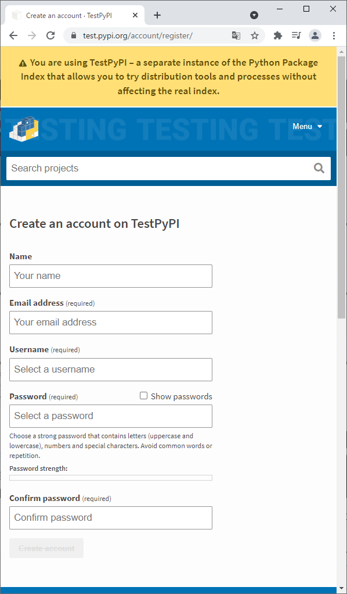

# PyPI
- 最終更新日：2021/09/30

## PyPI アカウント登録
1. [https://pypi.org/account/register/](https://pypi.org/account/register/)　を開き必要事項を入力
     
    - 名前、パスワード、メールアドレスを入力

1. 届いたメールの `click this link to verify your email address` をクリックして、メールアドレスを有効化する

## TestPyPI アカウント登録
1. [https://test.pypi.org/account/register/](https://test.pypi.org/account/register/)　を開き必要事項を入力
     
    - 名前、パスワード、メールアドレスを入力

1. 届いたメールの `click this link to verify your email address` をクリックして、メールアドレスを有効化する

***
## 参考
- [Pythonで作成したライブラリを、PyPIに公開/アップロードする](https://qiita.com/icoxfog417/items/edba14600323df6bf5e0)
