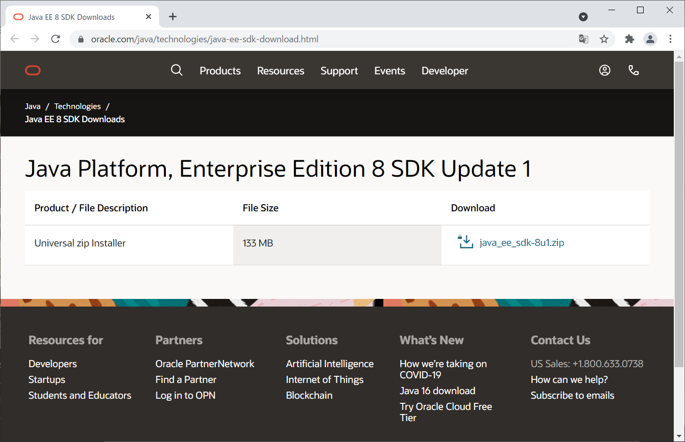
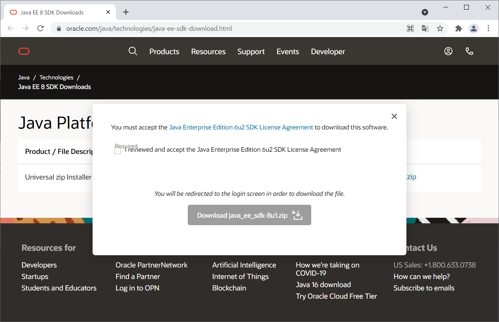
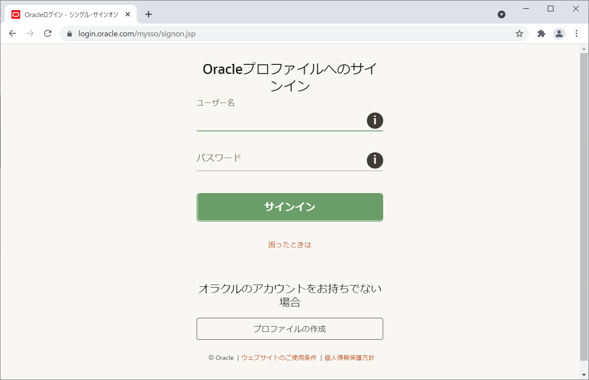

# Java EEインストール手順
- 最終更新日：2021/06/15

## 前提条件
- Java SEインストール手順

## ダウンロード
1. [https://www.oracle.com/java/technologies/java-ee-sdk-download.html](https://www.oracle.com/java/technologies/java-ee-sdk-download.html)からインストーラをダウンロード
     
     
    - メッセージ和訳
      - 本ソフトウェアをダウンロードするには、Java Enterprise Edition 6u2 SDK License Agreementに同意する必要があります。
      - Java Enterprise Edition 6u2 SDK License Agreementを確認し、同意します。
      - ファイルをダウンロードするためのログイン画面に移動します。

1. Oracleプロファイルへサインイン
     

## インストール
1. インストーラを起動
     
1. ライセンスを確認して [Next] 押下
     
1. インストール先のフォルダを選択して [Next] 押下
    - デフォルトのままで良い

     

## セッティング

***

## 参考
- [JSF 2.3 tutorial with Eclipse, Maven, WildFly and H2](https://balusc.omnifaces.org/2020/04/jsf-23-tutorial-with-eclipse-maven.html)
- [First Cup of Java EE Tutorial](https://javaee.github.io/firstcup/)
- [Java Platform, Enterprise Edition (Java EE) 8 Your First Cup: An Introduction to the Java EE Platform](https://javaee.github.io/firstcup/toc.html)
- [Java/JavaEE開発キットの作成](https://www.nextdoorwith.info/wp/se/devstd/jee7devkit/)
- [【Eclipse】WildFlyを設定しJava EE開発環境を構築する](https://qiita.com/yukgaejangbowser/items/3d2bc598db43f9637999)

***
