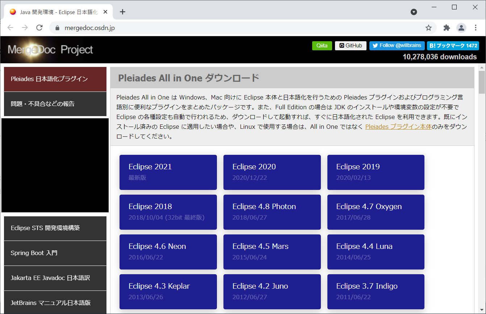
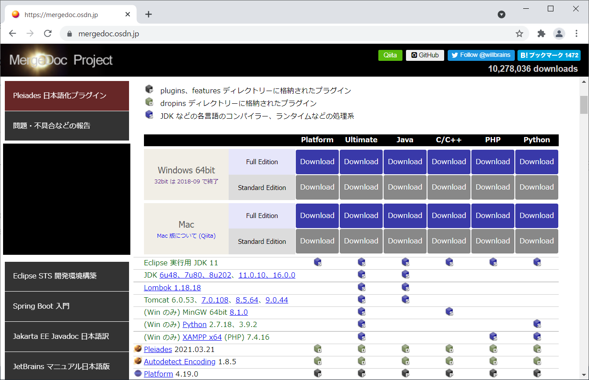
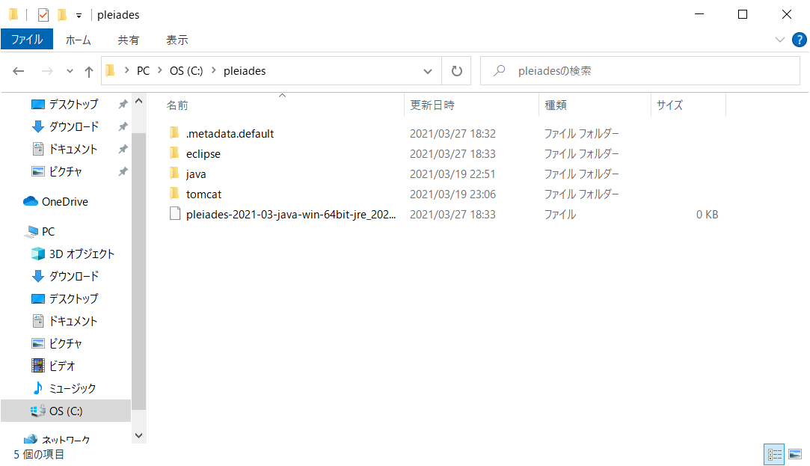
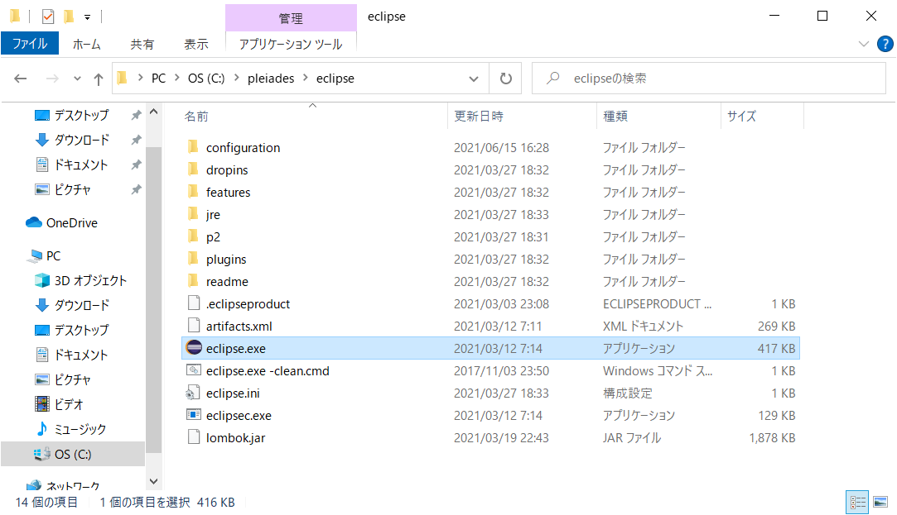
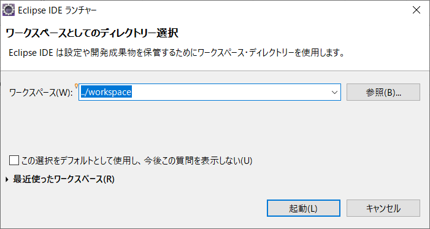
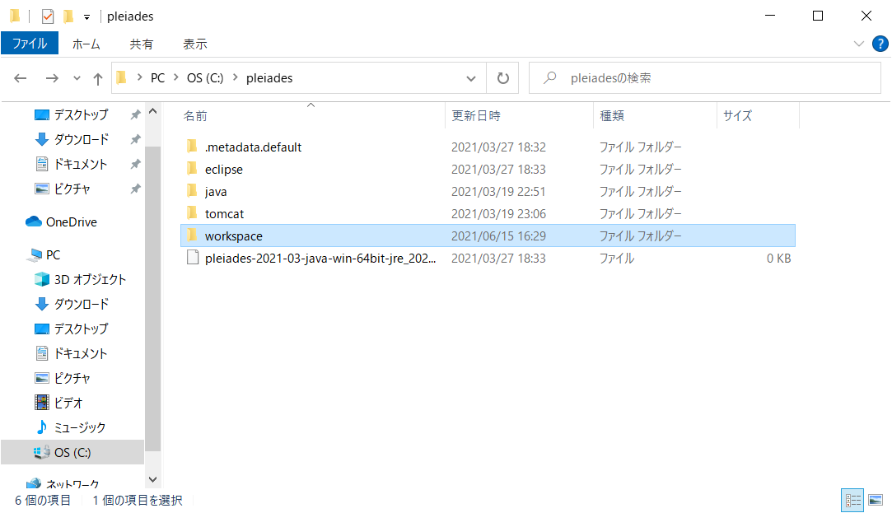
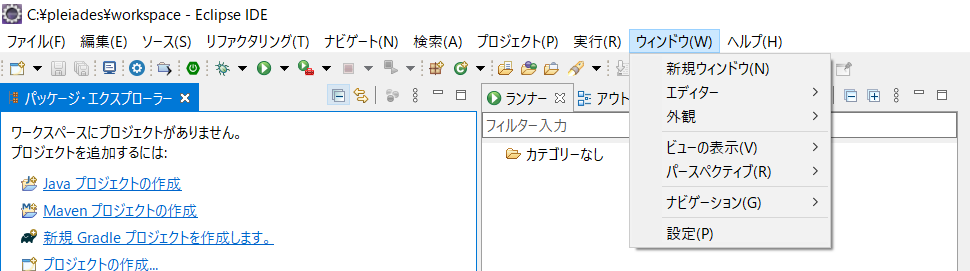
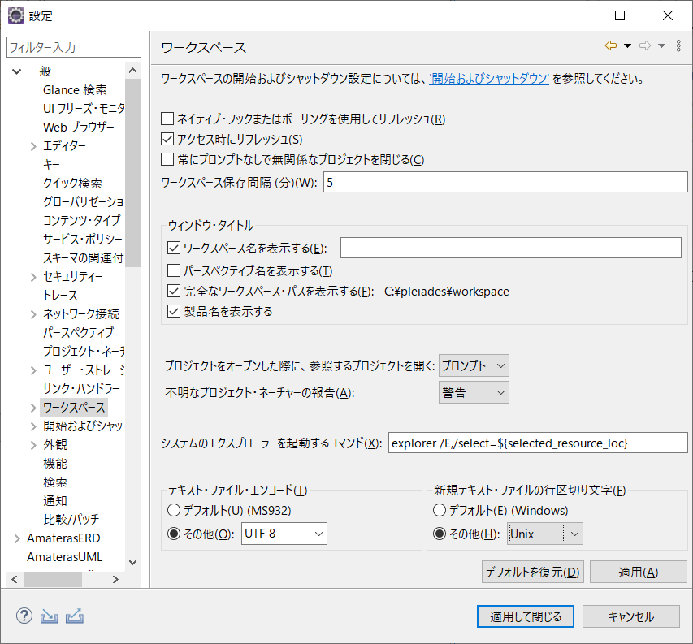
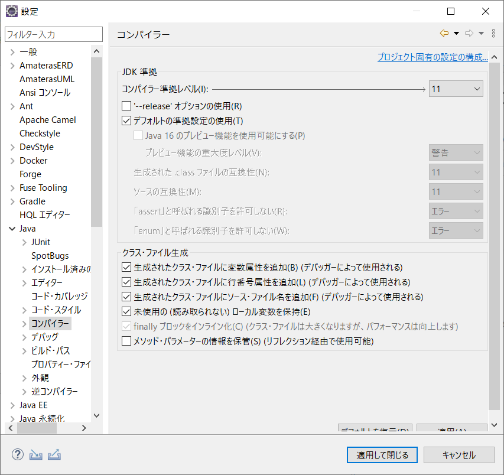

# Eclipse インストール手順
- 最終更新日：2021/06/16

## ダウンロード
1. [https://mergedoc.osdn.jp/](https://mergedoc.osdn.jp/)から任意のバージョンを選択
     
    - 例：[Eclipse 2021] を選択

1. 任意のエディションの [Download] を押下してインストーラをダウンロード
     
    - 例：[Windows 64bit] [Java] [Full Edition] を選択
    - Full Edition
      - JDK のインストールや環境変数の設定が不要
      - Eclipse の各種設定も自動実行
      - ダウンロードして起動すれば、すぐに日本語化された Eclipse を利用可能
    - Standard Edition
      - 別途 JDK のインストールや環境変数の設定が必要
      - Eclipse の各種設定を行う必要あり

## インストール
1. ダウンロードした zip ファイルを 7Zip で任意のフォルダに解凍
     
     
    - 例：C ドライブ直下に解凍

## セッティング
1. <解凍先のフォルダ>\pleiades\eclipse\eclipse.exe を実行
     

1. 任意のワークスペースを選択し [起動] 押下
     
    - デフォルトは [../workspace] = [<解凍先のフォルダ>\pleiades\workspace]
    - フォルダが存在しない場合は新規作成される

     

1. [ウィンドウ] > [設定] を開く
     

1. [一般] > [ワークスペース] を開き、以下の通り設定して [適用] 押下
    - テキスト・ファイル・エンコード
      - その他：UTF-8
    - 新規テキスト・ファイルの行区切り文字
      - その他：Unix

     
    - 各OSのコード
      | OS | 改行コード |
      | --- | --- |
      | UNIX系OS | LF（\n） |
      | Mac OS(9以前) | CR（\r） |
      | Mac OS X(10以降) | LF（\n） |
      | Windows | CR＋LF（\r\n） |

1. [Java] > [コンパイラー] を開き、コンパイラー準拠レベルを1.8以上に設定して [適用] 押下
     

### WildFly
- [インストール手順](./WildFly/)
- [JSF 2.3 tutorial with Eclipse, Maven, WildFly and H2](https://balusc.omnifaces.org/2020/04/jsf-23-tutorial-with-eclipse-maven.html)

***
