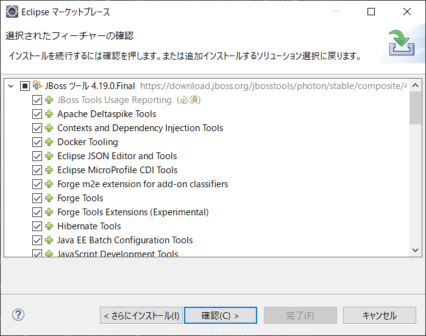

# WildFlyインストール手順
- 最終更新日：2021/06/16

## ダウンロード
1. [https://www.wildfly.org/downloads/](https://www.wildfly.org/downloads/)からインストーラをダウンロード
     

    - 例：[18.0.1 Final] の [Java EE Full & Web Distribution] からzipファイルをダウンロード

    | JBoss ASバージョン | 対応するJBoss EAP | Java EEバージョン |
    | --- | --- | --- |
    | WildFly 14 | JBoss EAP 7.2 | Java EE 8 |
    | WildFly 18 | JBoss EAP 7.3 | Java EE 8(Jakarta EE8) |

## インストール
1. ダウンロードした zipファイルを任意のフォルダに解凍
     
     

    - 例：C ドライブ直下に解凍

1. eclipse に JBossツールをインストール
    - eclipse を起動し、[ヘルプ] > [Eclipse マーケットプレイス] を開く

     
    - JBossツールを検索して [インストール] 押下

     
    - [確認] 押下

     
    - ライセンスに同意して [完了] 押下

     

## セッティング

1. WildFly をサーバに追加
    - [ウィンドウ] > [設定] を開く

     
    - [サーバー] > [ランタイム環境] を開き [追加] 押下

     
    - [WildFly xx Runtime] を選択して [次へ] 押下
      - 例：[WildFly 18 Runtime] を選択

     
    - [ホーム・ディレクトリー] に解凍したフォルダを入力して [完了] 押下
      - 例：[C:\wildfly-18.0.1.Final] を選択

     
    - [適用して閉じる] 押下

     

1. eclipse から WildFly を動かせるよう設定
    - [Windows] > [ビューの設定] > [その他] を開く

     
    - [サーバー] > [サーバー] を選択し [開く] 押下

     
    - 新規サーバを作成するためにリンクを押下

     
    - [WildFly xx] を選択して [次へ] 押下
      - 例：[WildFly 18] を選択

     
    - [完了] 押下

     

1. 起動検証
    - 追加したサーバを選択し起動

     
    - 以下のメッセージが出力されたらブラウザで [http://localhost:8080/](http://localhost:8080/) を開く

     
    - 下記の画面が表示されることを確認

     

***

## 参考
- [【WildFly】アプリケーションサーバ環境構築](https://qiita.com/yukgaejangbowser/items/ce9de433ad190388b597)
- [【Eclipse】WildFlyを設定しJava EE開発環境を構築する](https://qiita.com/yukgaejangbowser/items/3d2bc598db43f9637999)
- [WildFly](https://www.wildfly.org/downloads/)
- [WildFlyとは？](https://openstandia.jp/oss_info/wildfly/)
- [WildFlyをワイルドに動かしてみる ～インストールからデプロイまで～](https://qiita.com/tama1/items/829be5aacd81637ae73a)
- [WildFly環境構築のススメ](https://nakayama-tech.com/2020/12/23/wildfly-infra-01/)

***
