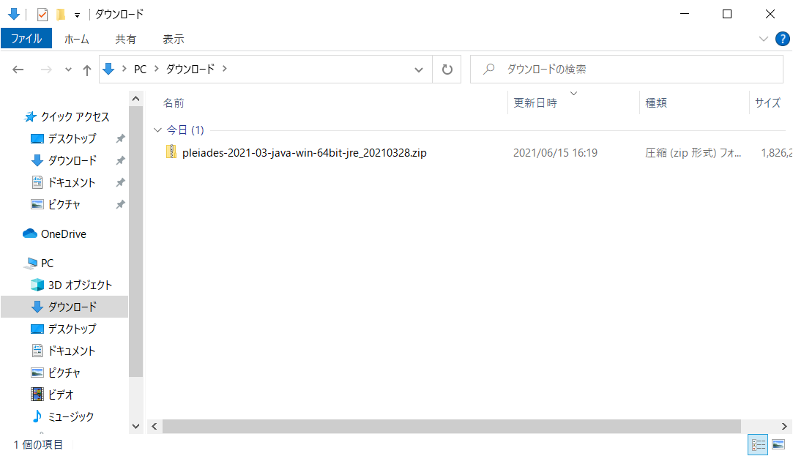
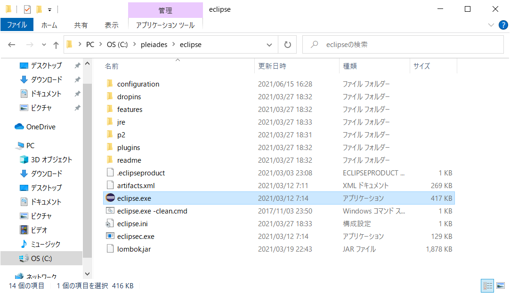

# Java SEインストール手順
- 最終更新日：2021/06/15

## ダウンロード
1. [https://mergedoc.osdn.jp/](https://mergedoc.osdn.jp/)から任意のバージョンを選択
     
    - 例：[Eclipse 2021] を選択

1. 任意のエディションの [Download] を押下してインストーラをダウンロード
     
    - 例：[Windows 64bit] [Java] [Full Edition] を選択
    - Full Edition
      - JDK のインストールや環境変数の設定が不要
      - Eclipse の各種設定も自動実行
      - ダウンロードして起動すれば、すぐに日本語化された Eclipse を利用可能
    - Standard Edition
      - 別途 JDK のインストールや環境変数の設定が必要
      - Eclipse の各種設定を行う必要あり

## インストール
1. ダウンロードした zip ファイルを 7Zip で任意のフォルダに解凍
     
     
    - 例：C ドライブ直下に解凍

## セッティング
1. <解凍先のフォルダ>\pleiades\eclipse\eclipse.exe を実行
     

1. 任意のワークスペースを選択し [起動] 押下
     
    - デフォルトは [../workspace] = [<解凍先のフォルダ>\pleiades\workspace]
    - フォルダが存在しない場合は新規作成される

     

***
