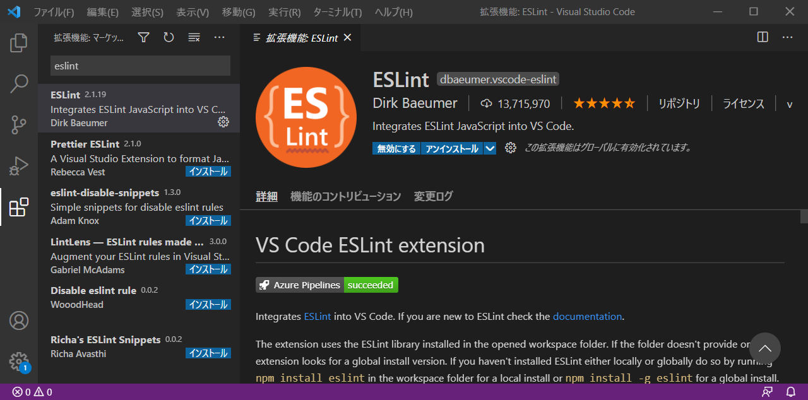
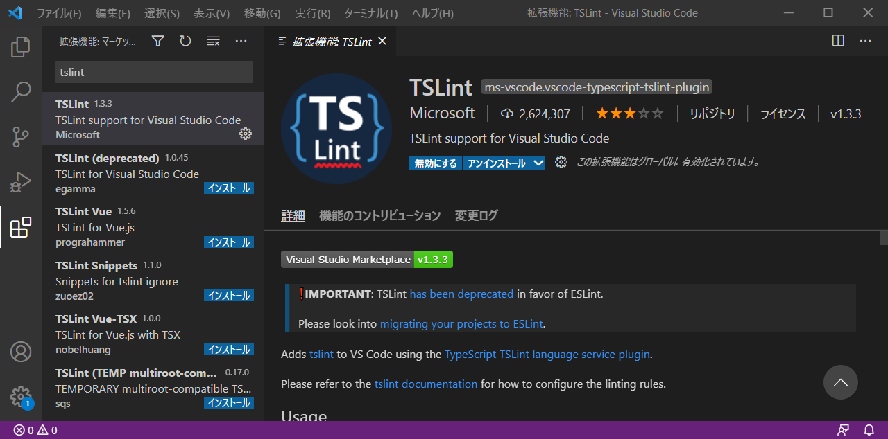
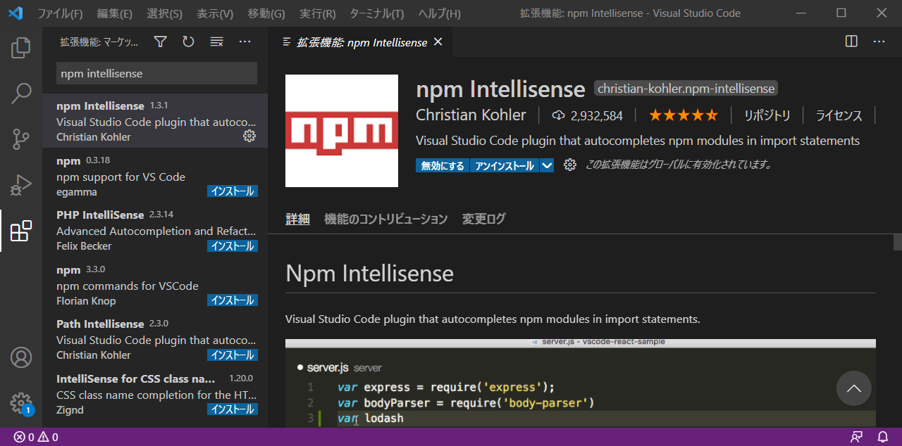

# Node.jsインストール手順
- 最終更新日：2022/11/20

## 手順
- [公式サイトを基に1バージョンのみインストール](./method01/)
- nvm を用いて複数バージョンインストール


## セッティング
### Visual Studio Code
1. 拡張機能から ESLint をインストールする
    <br />
1. 拡張機能から TSLint をインストールする
    <br />
1. 拡張機能から npm intellisense をインストールする
    <br />

## パッケージ管理
- 初期化
  - プロジェクトのルートディレクトリで実行
``` bash
npm init
```
- パッケージのインストール
  - グローバルインストールの場合は -g オプションを追記
``` bash
npm install <package-name>
```
- パッケージのインストール（バージョン指定）
``` bash
npm install <package-name>@<version>
```
- 依存関係追記
  - --save 公開する際に必要なパッケージ
  - --save-dev 開発時に必要なパッケージ
  - --no-save `package.json` に記載しない
``` bash
npm install --save <package-name>
npm install --save-dev <package-name>
npm install --no-save <package-name>
```
- 未更新パッケージ確認
``` bash
npm outdated
```
- パッケージのアップデート
  - package.json に記載されているバージョンに更新
``` bash
npm update
```
- パッケージの一括最新化
  - 事前に npm-check-updates を npm install でインストールしておく
``` bash
npm-check-updates -u
```
- パッケージのアンインストール
  - グローバルインストールの場合は -g オプションを追記
  - 依存関係を削除する場合は --save、--save-dev オプションを追記
``` bash
npm uninstall <package-name>
```
- パッケージの一括インストール
  - package.json がある状態で実行
``` bash
npm install
```
***

## 参考
- [Visual Studio CodeとNode.jsの導入について](https://qiita.com/GRGSIBERIA/items/b8cd4a2b3635d1bb0391)
- [npm入門](https://qiita.com/maitake9116/items/7825d90c09f3e2f87dea)

***
