# Node.jsインストール手順
- 最終更新日：2021/04/02

## ダウンロード
1. [https://nodejs.org/ja/download/](https://nodejs.org/ja/download/)からインストーラをダウンロード
    <br />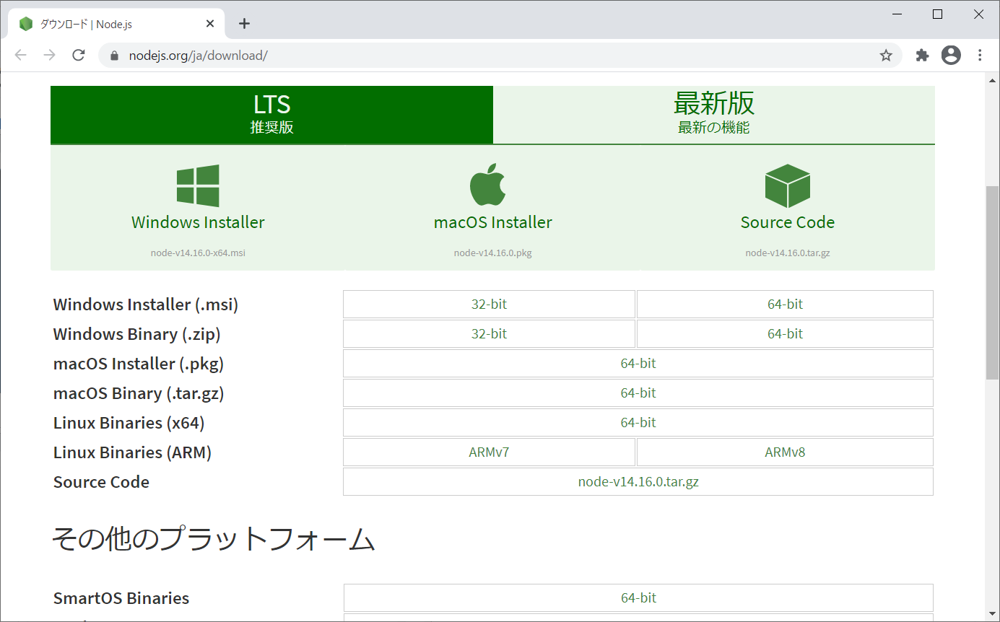

## インストール
1. インストーラを起動
    <br />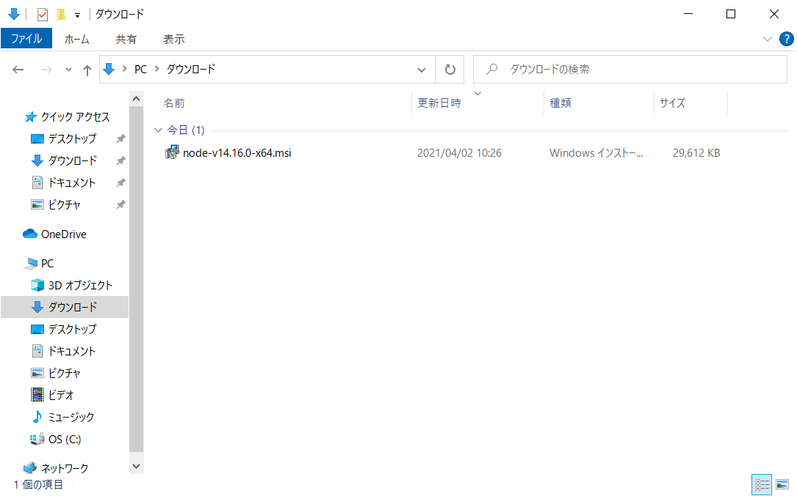
1. [Next] 押下
    <br />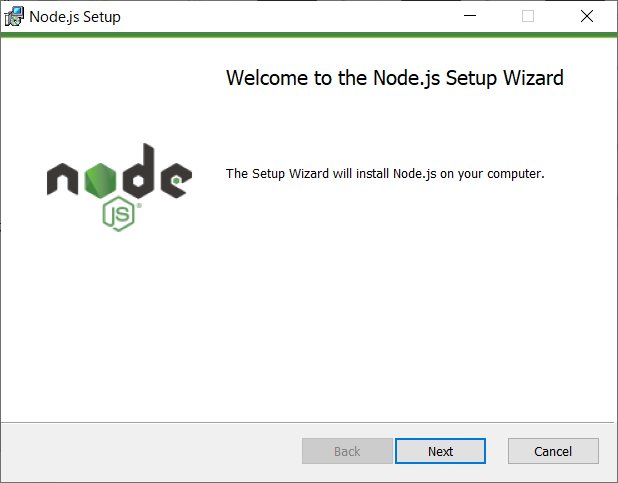
1. ライセンスを確認して [Next] 押下
    <br />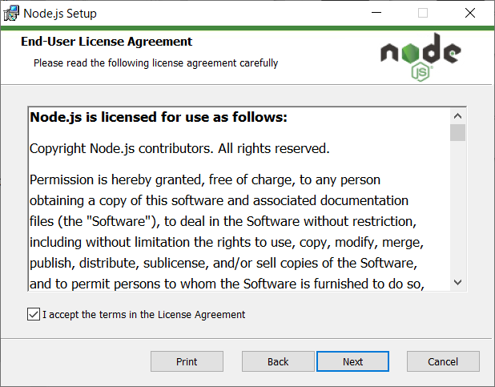
1. インストール先のフォルダを選択して [Next] 押下
    - デフォルトのままで良い

    <br />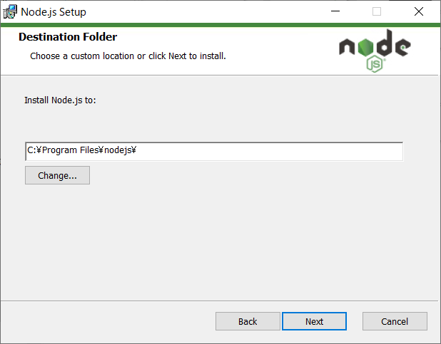
1. インストール内容をカスタムして [Next] 押下
    - デフォルトのままで良い

    <br />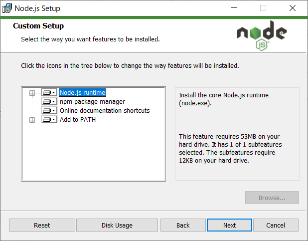
1. チェックを外して [Next] 押下
    - デフォルトのままで良い

    <br />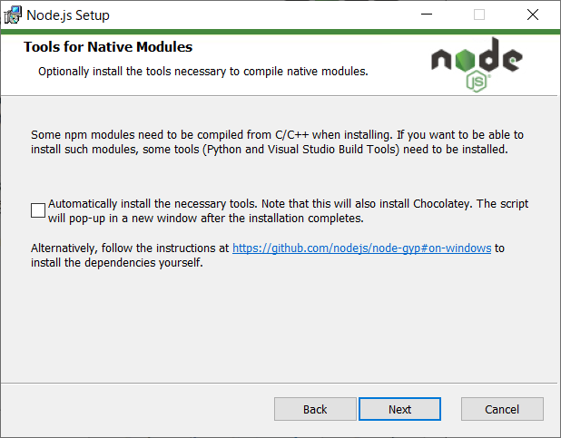
    - 一部のnpmモジュールはインストール時にC/C++からコンパイルする必要があるため、必要なツールを自動的にインストールするか？という意味
    - 必要に応じて対応
1. [Install] 押下
    <br />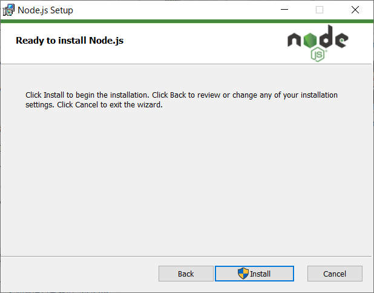
1. インストールが開始される
    <br />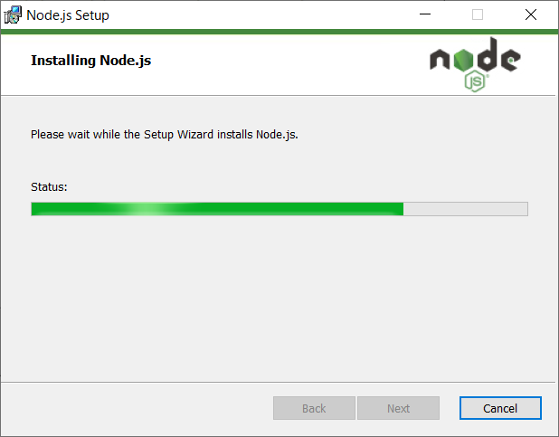
1. [Finish] 押下
    <br />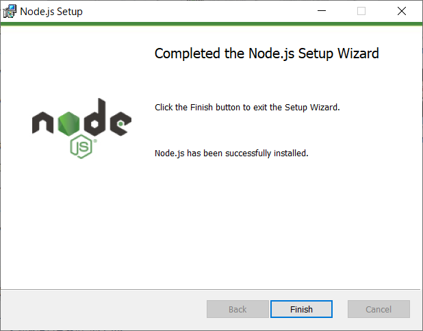

## セッティング
### Visual Studio Code
1. 拡張機能から ESLint をインストールする
    <br />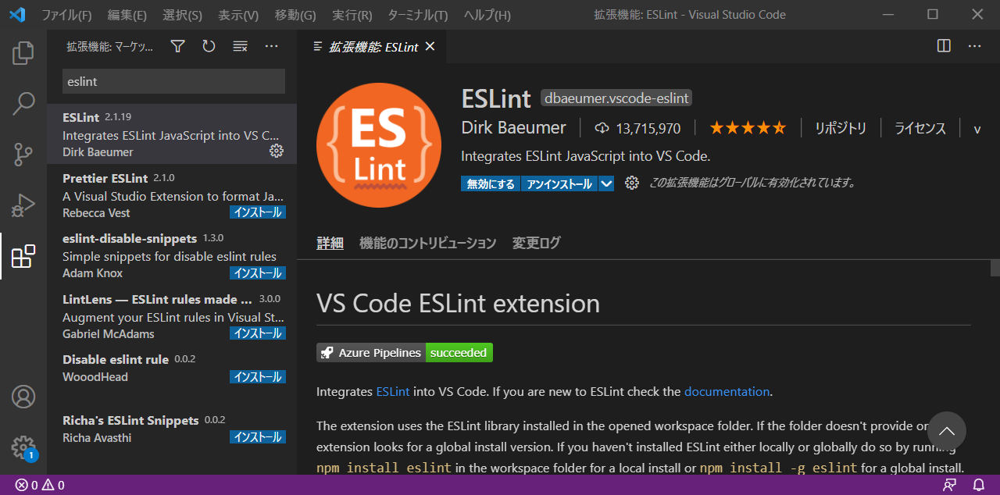
1. 拡張機能から TSLint をインストールする
    <br />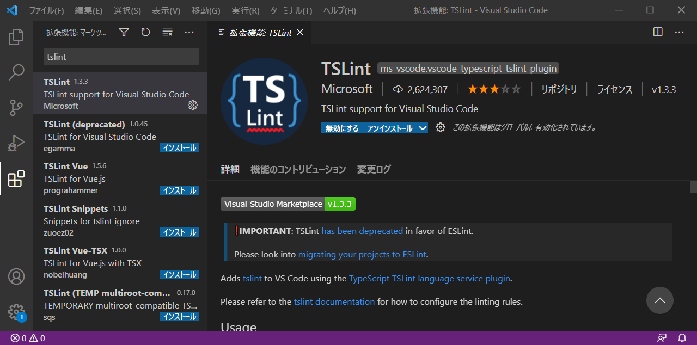
1. 拡張機能から npm intellisense をインストールする
    <br />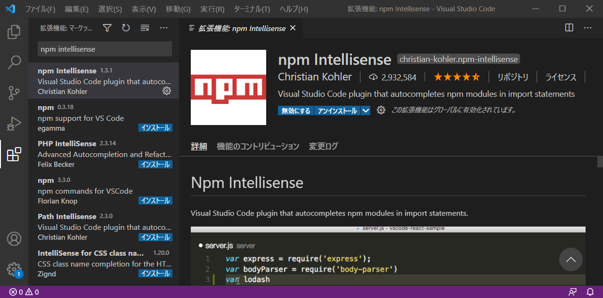

## パッケージ管理
- 初期化
  - プロジェクトのルートディレクトリで実行
``` bash
npm init
```
- パッケージのインストール
  - グローバルインストールの場合は -g オプションを追記
``` bash
npm install <package-name>
```
- パッケージのインストール（バージョン指定）
``` bash
npm install <package-name>@<version>
```
- 依存関係追記
  - --save 公開する際に必要なパッケージ
  - --save-dev 開発時に必要なパッケージ
``` bash
npm install --save <package-name>
npm install --save-dev <package-name>
```
- 未更新パッケージ確認
``` bash
npm outdated
```
- パッケージのアップデート
  - package.json に記載されているバージョンに更新
``` bash
npm update
```
- パッケージの一括最新化
  - 事前に npm-check-updates を npm install でインストールしておく
``` bash
npm-check-updates -u
```
- パッケージのアンインストール
  - グローバルインストールの場合は -g オプションを追記
  - 依存関係を削除する場合は --save、--save-dev オプションを追記
``` bash
npm uninstall <package-name>
```
- パッケージの一括インストール
  - package.json がある状態で実行
``` bash
npm install
```
***

## 参考
- [公式ガイド](https://nodejs.org/ja/docs/guides/)
- [Node.jsをインストールする](https://qiita.com/sefoo0104/items/0653c935ea4a4db9dc2b)
- [Visual Studio CodeとNode.jsの導入について](https://qiita.com/GRGSIBERIA/items/b8cd4a2b3635d1bb0391)
- [npm入門](https://qiita.com/maitake9116/items/7825d90c09f3e2f87dea)

***
