# Node.jsインストール手順
- 最終更新日：2022/11/20

## ダウンロード
1. [https://github.com/coreybutler/nvm-windows/releases](https://github.com/coreybutler/nvm-windows/releases) から`nvm-setup.zip` をダウンロード
    <br />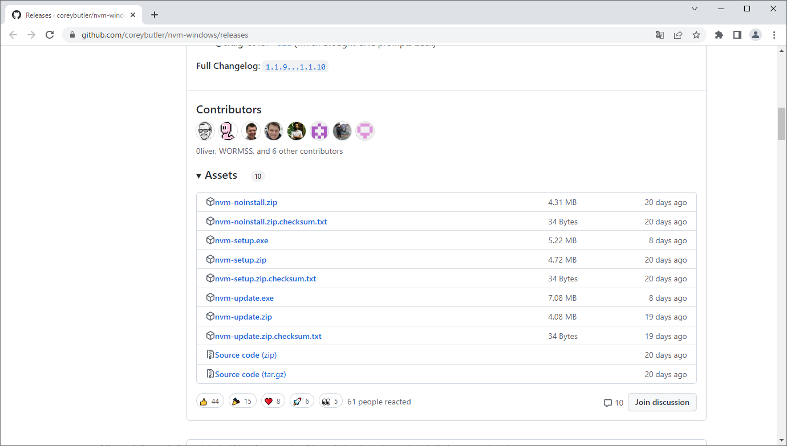

## インストール
1. zipファイルを解凍し、`nvm-setup.exe` を起動
    <br />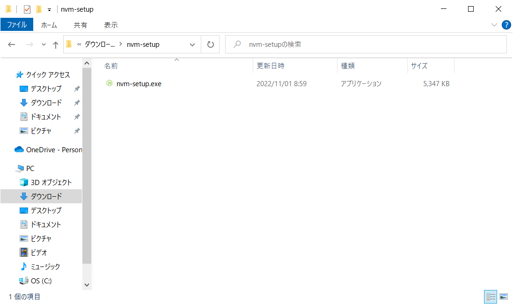
1. ライセンスを確認して [Next] 押下
    <br />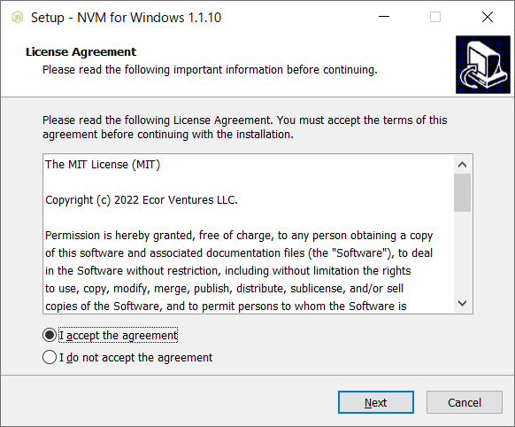
1. インストール先のフォルダを選択して [Next] 押下
    - デフォルトのままで良い

    <br />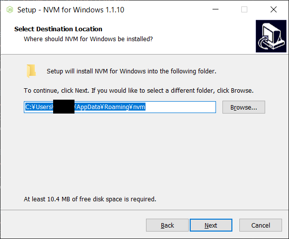
1. シンボリックリンクを作成するフォルダを選択して [Next] 押下
    - デフォルトのままで良い

    <br />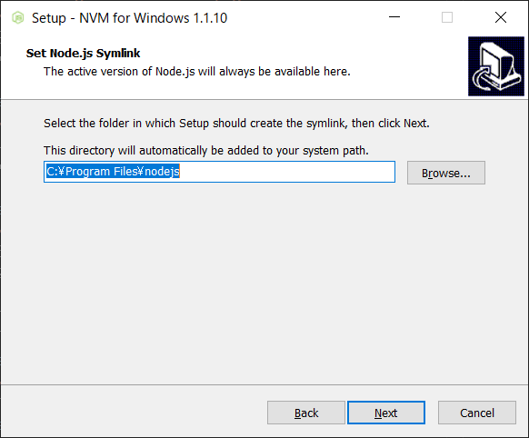
1. [Install] 押下
    <br />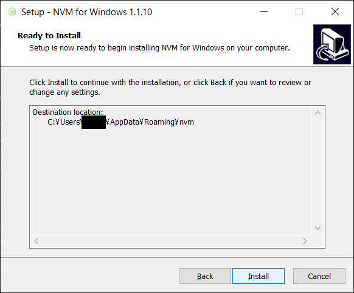
1. インストールが開始される
    <br />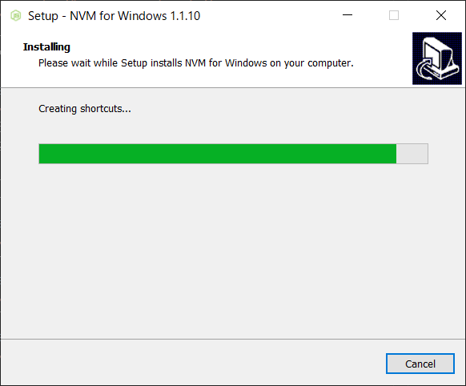
1. [Finish] 押下
    <br />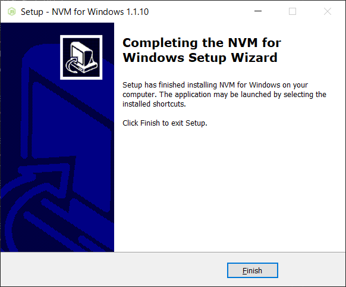

## セッティング
1. `nvm ls` を実行し、現在インストールしている Node のバージョンを確認
    <br />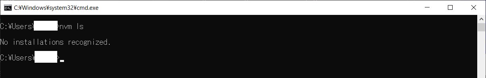
1. `nvm list available` を実行し、LTSの現在のバージョンを調べる
    <br />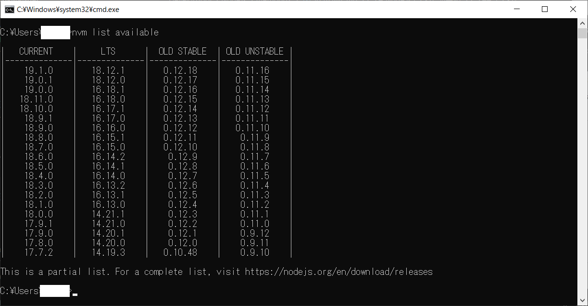
1. `nvm install <version>` を実行し、そのバージョンのLTSをインストール
    - 18.12.1 をインストールする場合

    <br />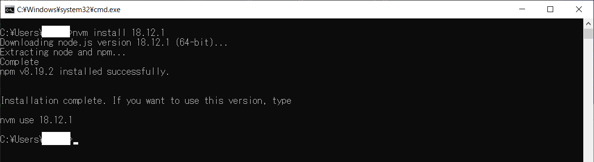
1. `nvm ls` を実行し、現在インストールしている Node のバージョンを確認
    <br />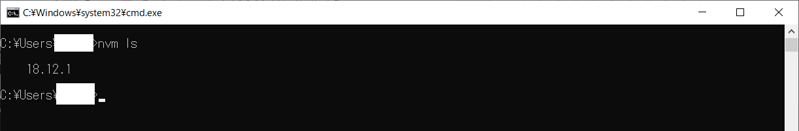
1. `nvm use <version>` を実行し、使用するバージョンを設定
    - 18.12.1 を使用する場合

    <br />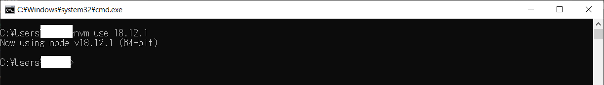
1. `nvm ls` を実行し、現在使用する Node のバージョンを確認
    <br />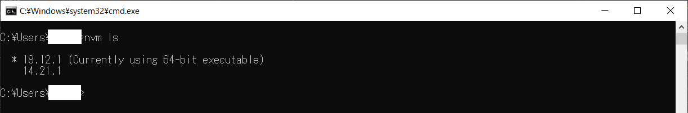

## バージョン管理
- Node.js のインストール
``` bash
nvm install <version>
```
- Node.js のアンインストール
``` bash
nvm uninstall <version>
```
- 使用する Node.js の指定
``` bash
nvm use <version>
```

***

## 参考
- [Windows での NodeJS のインストール](https://learn.microsoft.com/ja-jp/windows/dev-environment/javascript/nodejs-on-windows)
- [nvm で複数の Node.js バージョンを切り替えて使用する (Node Version Manager)](https://maku77.github.io/nodejs/env/nvm)

***
