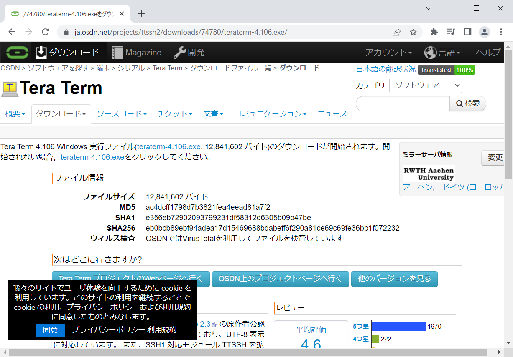
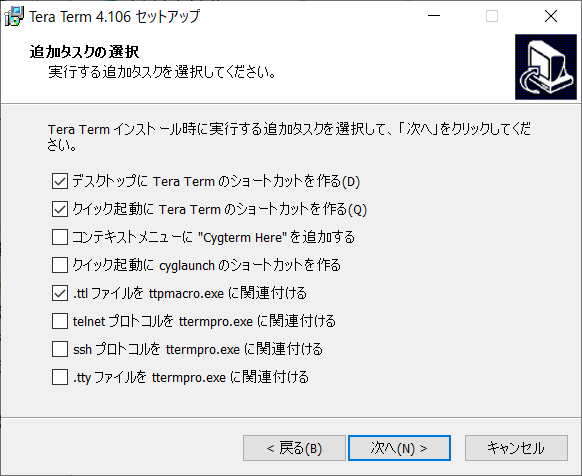
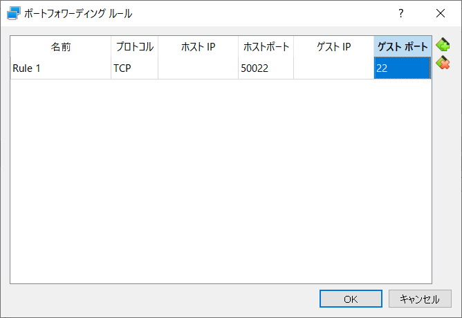

# TeraTermインストール手順
- 最終更新日：2022/06/01

## ダウンロード
1. [https://ja.osdn.net/projects/ttssh2/releases/](https://ja.osdn.net/projects/ttssh2/releases/) からインストーラをダウンロード
    - [teraterm-x.yyy.exe] を押下

     
    - インストーラがダウンロードされる

     

## インストール
1. インストーラを起動
     
1. [日本語] を選択し [OK] 押下
     
1. [同意する] を選択して [次へ] 押下
     
1. インストール先を指定して [次へ] 押下
    - デフォルトのままで良い

     
1. コンポーネントを選択して [次へ] 押下
    - デフォルトのままで良い

     
1. [日本語] を選択して [次へ] 押下
    - デフォルトのままで良い

     
1. [次へ] 押下
     
1. 追加タスクを選択して [次へ] 押下
    - [.ttl ファイルを ttpmacro.exe に関連付ける] を選択

     
1. [インストール] 押下
     
1. [完了] を押下して閉じる
     

## セッティング
- NAT にポートフォワーディングを設定して接続する手順

1. VirtualBox を開き [設定] を押下
     

1. [ネットワーク] を押下し [ポートフォワーディング] を押下
    - 割り当て：NAT

     

1. ポートフォワーディングルールを追加し [OK] を押下
    - 名前：任意の名前
    - プロトコル：TCP
    - ホストポート：使用していない任意のポート番号
    - ゲストポート：22（sshのポート番号）

     

1. [OK] を押下
    - 割り当て：NAT

     

1. CentOS を起動
    - 起動していない場合は [起動] を押下

     
    - 起動済みの場合は [リセット] を押下

     

## 接続
1. TeraTerm を開き接続情報を入力して [OK] を押下
    - ホスト：localhost:[ホストポート]
    - TCPポート：22（sshのポート番号）

     

1. 【初回のみ】[続行] を押下
     

1. ユーザ名、パスフレーズを入力し [OK] を押下
    - ユーザ名：仮想マシンに追加したユーザ名
    - パスフレーズ：仮想マシンに追加したユーザ名のパスワード

     

1. 接続できたことを確認
     

1. [ exit ] コマンドで切断
     

***

## 参考
- [【ゼロからわかる】Teratermのインストールと使い方](https://eng-entrance.com/teraterm-install)
- [20時間で【Linux】マスター！！基礎、シェルスクリプト、Docker基礎、ネットワーク 、セキュリティを体系的に解説](https://www.udemy.com/course/linuxlpic/)

***
