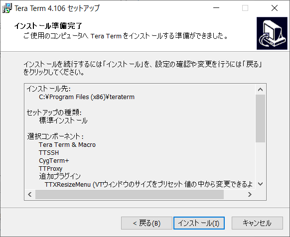

# TeraTermインストール手順
- 最終更新日：2022/06/01

## ダウンロード
1. [https://ja.osdn.net/projects/ttssh2/releases/](https://ja.osdn.net/projects/ttssh2/releases/) からインストーラをダウンロード
    - [teraterm-x.yyy.exe] を押下

     
    - インストーラがダウンロードされる

     

## インストール
1. インストーラを起動
     
1. [日本語] を選択し [OK] 押下
     
1. [同意する] を選択して [次へ] 押下
     
1. インストール先を指定して [次へ] 押下
    - デフォルトのままで良い

     
1. コンポーネントを選択して [次へ] 押下
    - デフォルトのままで良い

     
1. [日本語] を選択して [次へ] 押下
    - デフォルトのままで良い

     
1. [次へ] 押下
     
1. 追加タスクを選択して [次へ] 押下
    - [.ttl ファイルを ttpmacro.exe に関連付ける] を選択

     
1. [インストール] 押下
     
1. [完了 を押下して閉じる
     

***

## 参考
- [【ゼロからわかる】Teratermのインストールと使い方](https://eng-entrance.com/teraterm-install)

***
