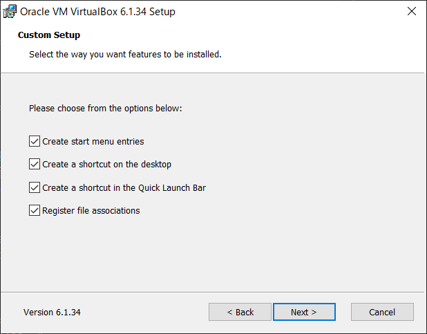
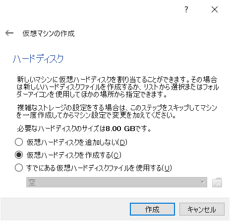

# VirtualBoxインストール手順
- 最終更新日：2022/06/01

## ダウンロード
1. [https://www.python.org/downloads/](https://www.virtualbox.org/wiki/Downloads) からインストールしたいプラットフォームのインストーラをダウンロード
     
    - 例：Windowsの場合は[Windows hosts]を選択

     
    - 開発元であるオラクルのWebサイトからもダウンロード可能だが、VirtualBox.orgの方が若干最新バージョンへの更新が早い
    - [https://www.oracle.com/jp/virtualization/technologies/vm/downloads/virtualbox-downloads.html](https://www.oracle.com/jp/virtualization/technologies/vm/downloads/virtualbox-downloads.html)

## インストール
1. インストーラを起動
     
1. [Next] 押下
     
1. オプション機能を選択して [Next] 押下
    - インストールする内容をカスタマイズしたり、インストールフォルダを変更したりすることができる
    - デフォルトのままで良い

     
1. オプション機能を選択して [Next] 押下
    - Register file associations：「.vbox」などの仮想ファイルの関連付けを登録する
    - デフォルトのままで良い

     
1. [Yes] 押下
    - インストール中に一時的にネットワーク接続が切断される可能性があるという警告

     
1. [Install] 押下
     
1. インストールが開始される
     
1. [インストール] 押下
     
1. [Finish] を押下して閉じる
     

## CentOSダウンロード
1. [https://www.centos.org/download/](https://www.centos.org/download/) を開き [x86_64] を押下

     
     

1. 任意のミラーサイトのリンクを押下
    - 例：http://ftp-srv2.kddilabs.jp/Linux/packages/CentOS/7.9.2009/isos/x86_64/

     

1. OSイメージをダウンロード
    - [CentOS-7-x86_64-DVD-2009.iso] を押下

     

## 仮想マシン作成
1. VirtualBox を開き [新規] を押下

     

1. 仮想マシンを設定し [次へ] を押下
    - 名前：任意の名前
    - タイプ：Linux
    - バージョン：Red Hat (64-bit)

     

1. [次へ] を押下
    - 1024MB を指定
    - デフォルトのままで良い

     

1. [作成] を押下
    - [仮想ハードディスクを作成する] をチェック
    - デフォルトのままで良い

     

1. [次へ] を押下
    - [VDI (VirtualBox Disc Image)] をチェック
    - デフォルトのままで良い

     

1. [次へ] を押下
    - [可変サイズ] をチェック
    - デフォルトのままで良い

     

1. 仮想ハードディスクのサイズを指定し [作成] を押下
    - デフォルトの 8.00 GB から 16.00 GB に変更する

     

1. [起動] を押下

     

1. プルダウン横のアイコンを押下し [追加] を押下

     
     

1. ダウンロードしたOSイメージを開き [選択] を押下

     
     

1. [起動] を押下

     

1. [Install CentOS 7] を押下

     

    - 次の画面が表示される場合は [キャプチャー] を押下

     

1. [日本語] を選択し [続行] を押下

     

***

## 参考
- [もう絶対に忘れない Linux コマンド【Linux 100本ノック+名前の由来+丁寧な解説で、長期記憶に焼き付けろ！】](https://www.udemy.com/course/linux100test/)
- [OracleVM VirtualBoxのインストール手順＜Windows向け＞](https://sukkiri.jp/technologies/virtualizers/virtualbox/virtualbox-win_install.html)
- [第4回 要注目のPC向け無償仮想化ソフト「VirtualBox」](https://xtech.nikkei.com/it/article/COLUMN/20120330/388285/)

***
