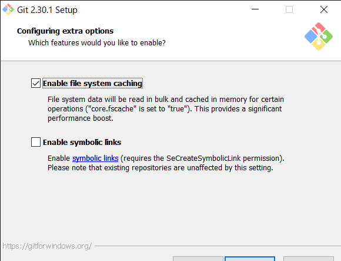

# Gitインストール手順
## ダウンロード
- [https://git-scm.com/downloads](https://git-scm.com/downloads)からインストーラをダウンロード
  
  - 端末のbit数に合わせて32bitバージョン/64bitバージョンのインストーラがダウンロードされる
   
- 遷移先の画面で別バージョンのインストーラをダウンロードすることも可能
  

## インストール
- 手順1
  
- 手順2
  
- 手順3
  
- 手順4
  
- 手順5
  
- 手順6
  
  
- 手順7
  
- 手順8
  
- 手順9
  
- 手順10
  
- 手順11
  
- 手順12
  
- 手順13
  
- 手順14
  
- 手順15
  
- 手順16
  
- 手順17
  

## セッティング
- 手順1
  
- 手順2
  
  

***
## 参考
- [Windows10にGitをインストール (2021年02月更新)](https://www.curict.com/item/60/60bfe0e.html)
