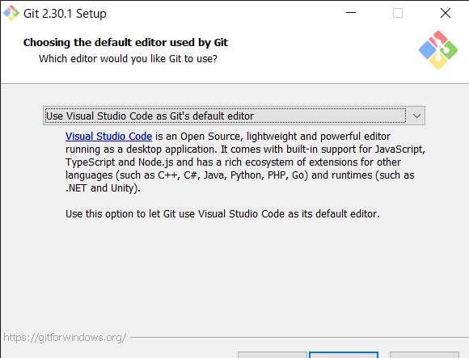
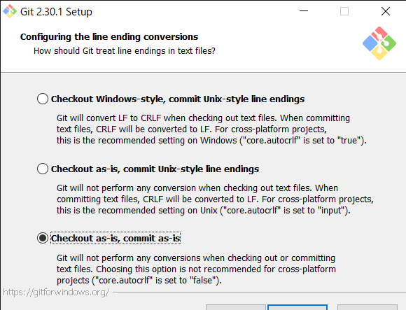
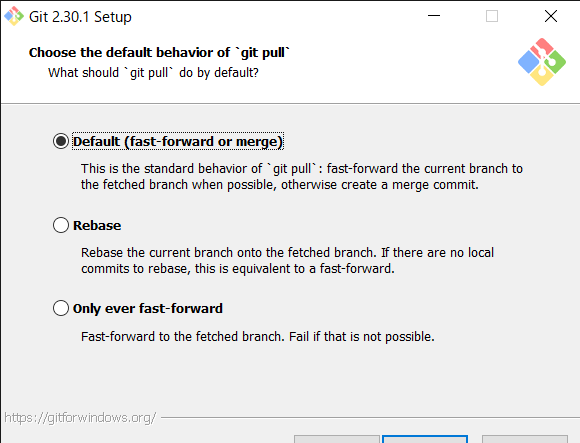
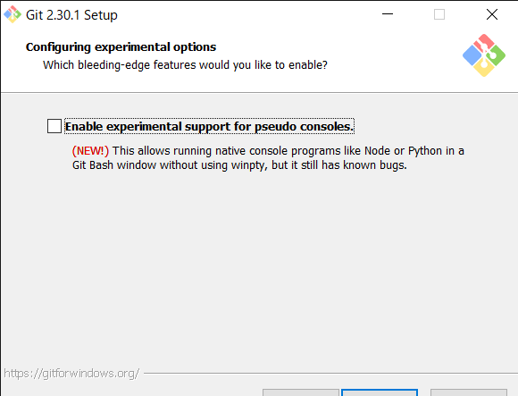

# Gitインストール手順
## ダウンロード
1. [https://git-scm.com/downloads](https://git-scm.com/downloads)からインストーラをダウンロード
    <br />
    - 端末のbit数に合わせて32bitバージョン/64bitバージョンのインストーラがダウンロードされる
1. 遷移先の画面で別バージョンのインストーラをダウンロードすることも可能
    <br />

## インストール
1. インストーラを起動
    <br />
1. ライセンスを確認して [Next] 押下
    <br />
1. インストール先のフォルダを選択して [Next] 押下
    - デフォルトのままで良い

    <br />
1. [Use a True font in all console windows] を選択せずに [Next] 押下
    <br />
    - Additonal icons
      - On the Desktop
        - デスクトップにアイコンを追加する
    - Windows Explorer integration
      - 右クリックメニューにGitを起動するメニューを追加する
      - Git Bash Here
        - Git Bash（Git用のシェル）が起動する
      - Git GUI Here
        - Git GUI（GUI版のGit）が起動する
    - Git LFS (Large File Support)
      - Git LFS がインストールされる
      - Git が苦手な大容量ファイルを扱うためのツール
      - [git lfs] コマンドが使用できるようになる
    - Associate .git* configuration files with the default text editor
      - Git関連のファイル（[.git] で始まるファイル）をデフォルトテキストエディタに関連付ける
    - Associate .sh files to be run with Bash
      - shファイルをGit Bashに関連付ける
    - Use a TrueType font in all console windows
      - コマンドプロンプトが TrueType フォントになる
      - <font color="red">文字化けする可能性があるため選択しない</font>
    - Check daily for Git for Windows updates
      - 最新の Git for Windows が公開されたときに通知される
1. スタートメニューへの追加先を選択して [Next] 押下
    - デフォルトのままで良い

    <br />
1. デフォルトエディタに Visual Studio Code を選択して [Next] 押下
    <br />
    - デフォルトでは Vim が選択されている
    - Git Bash や コマンドプロンプト、PowerShell でメッセージ入力が必要なコマンドを実行すると起動される（らしい）
1. [git init] コマンドでリポジトリを新規作成する際のデフォルトブランチ名を main に指定して [Next] 押下
    <br />
    - GitHub のデフォルトブランチ名が [main] であるため [main] を採用
    - Let Git decide
      - デフォルトブランチ名は [master]
    - Overrride the default branch name for new repositories
      - デフォルトブランチ名を、指定したブランチ名に指定
1. Windows の PATH環境変数に追加するフォルダを選択して [Next] 押下
    - デフォルトのままで良い

    <br />
    - Use Git from Git Bash only
      - Git を Git Bash でのみ使用する場合に選択
      - PATH には何も追加されない
    - Git from the command line and also from 3rd-party software
      - Git をコマンドプロンプトや PowerShell でも使用する場合に選択
      - PATH に次のフォルダが追加される
        - [Gitインストール先] \Git\cmd
    - Use Git and optional Unix tools from the Windows Command Prompt
      - コマンドプロンプトや PowerShell で Unix のコマンドが使えるようになる
      - <font color="red">Windows に同名のコマンドがあるため、よくわからない場合は選択しない</font>
      - PATH に次のフォルダが追加される
        - [Gitインストール先] \Git\cmd
        - [Gitインストール先] \Git\mingw64\bin
        - [Gitインストール先] \Git\usr\bin
1. リモートリポジトリにHTTPS接続する際の設定を選択して [Next] 押下
    - デフォルトのままで良い

    <br />
    - Use the OpenSSL library
      - HTTPS接続の検証にOpenSSLのルート証明書を使用
    - Use the native Windows Secure Channel library
      - HTTPS接続の検証にWindows証明書ストアのルート証明書を使用
      - Active Directory で管理されている Windowsサーバーや TFSサーバー上の git リポジトリ に接続する際、こちらを選択しないと接続できない場合がある
1. [Checkout as-is, commit as-is] を選択して [Next] 押下
    <br />
    - デフォルトでは自動変換がオンになっているが、意図せぬトラブルが発生するのでオフにする
    - Checkout Windows-style, commit Unix-style line endings
      - 改行コードがチェックアウト時に「CR-LF」、コミット時に「LF」に自動変換される
    - Checkout as-is, commit Unix-style line endings
      - 改行コードがコミット時に「LF」に自動変換される
    - Checkout as-is, commit as-is
      - 改行コードの自動変換を行わない
1. Git Bashで使用するターミナルを選択して [Next] 押下
    - デフォルトのままで良い

    <br />
    - Use MinTTY(the default terminal of MSYS2)
      - MinTTYを使用
    - Use Windows' default console window
      - Windowsの標準コンソールを使用
      - ConEmuなど別のコンソールを導入している場合もこちらを選択
1. git pull でマージを行う際の挙動を選択して [Next] 押下
    - デフォルトのままで良い

    <br />
    - Default(fast-forward or merge)
      - 「git pull --ff」 が実行される
    - Rebase
      - 「git pull --rebase」 が実行される
    - Only ever fast-forard
      - 「git pull --ff-only」 が実行される
1. 資格情報マネージャー(Credential Manager)を選択して [Next] 押下
    - デフォルトのままで良い

    <br />
    - インストールすると、httpsでリモートリポジトリに接続する際、毎回認証する手間が省ける
    - Git Credential Manager Core
      - 新しいバージョンの Credential Manager
    - Git Credential Manager
      - <font color="red">【非推奨】</font>旧バージョンのCredential Manager
    - None
      - Credential Manager を使用しない
1. オプションを選択して [Next] 押下
    - デフォルトのままで良い

    <br />
    - Enable file system caching
      - Git関連のファイルをキャッシュし、動作を速くする
      - その代わり、通常よりも多くのメモリーを使用する
    - Enable symbolic links
      - リポジトリ内でシンボリックリンクを使用したい場合にチェックする
      -  Windowsのシンボリックリンクは Linux系OSと互換性がないため、Windows版Gitではシンボリックリンクの代わりに、リンク先を記されたテキストファイルが作成される
      - チェックをオンにするとテキストファイルではなく、シンボリックリンクが作成される
1. [Install] 押下
    - デフォルトのままで良い

    <br />
    - Enable experimental support for pseudo consoles.
      - チェックをすると、Git Bash window 上で Python や Node のコンソールプログラムが動作するようになる
      - <font color="red">既知のバグがあるため選択しない</font>
1. インストールが開始される
    <br />
1. [Finish]] 押下
    - チェックは外して良い

    <br />

## セッティング
1. Git Bash を起動し、以下のコマンドを実行する
    - ユーザ名と e-mailアドレスは GitHub のアカウント情報を指定
    ``` bash
    git config --global user.name "ユーザ名"
    git config --global user.email "e-mailアドレス"
    git config --global core.quotepath false
    git config --global core.ignorecase false
    ```
    <br />
    - core.quotepath
      - false
        - git statusで変更ファイル一覧を表示するときに、日本語のファイル名が文字化けしない
    - core.ignorecase
      - false
        - ファイルの大文字・小文字を区別する
1. 設定した内容を確認
    - C:\Users\ [ユーザ名] \.gitconfig を確認

    <br />
    - .bash_history は削除して良い（Git Bash で実行したコマンドが記録されている）

    <br />
1. 端末を再起動
    - アイコンオーバーレイは再起動後に有効になる

***
## 参考
- [Windows10にGitをインストール (2021年02月更新)](https://www.curict.com/item/60/60bfe0e.html)
- [最低限しておくといいgitconfigの設定](https://qiita.com/hayamofu/items/d8103e789196bcd8b489)
