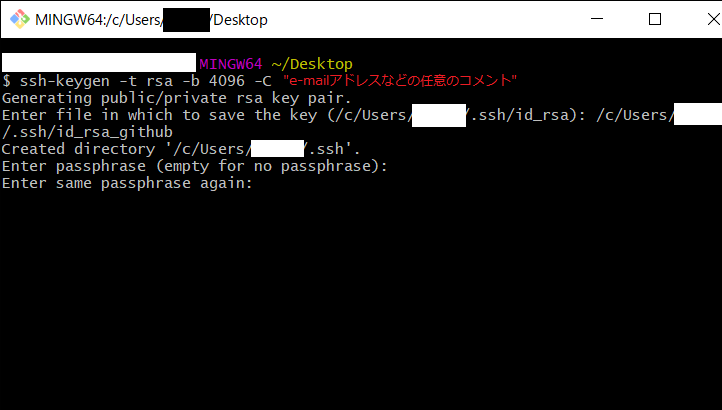
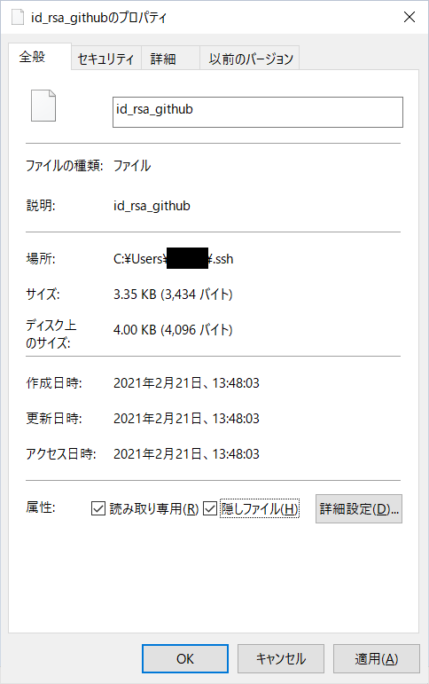
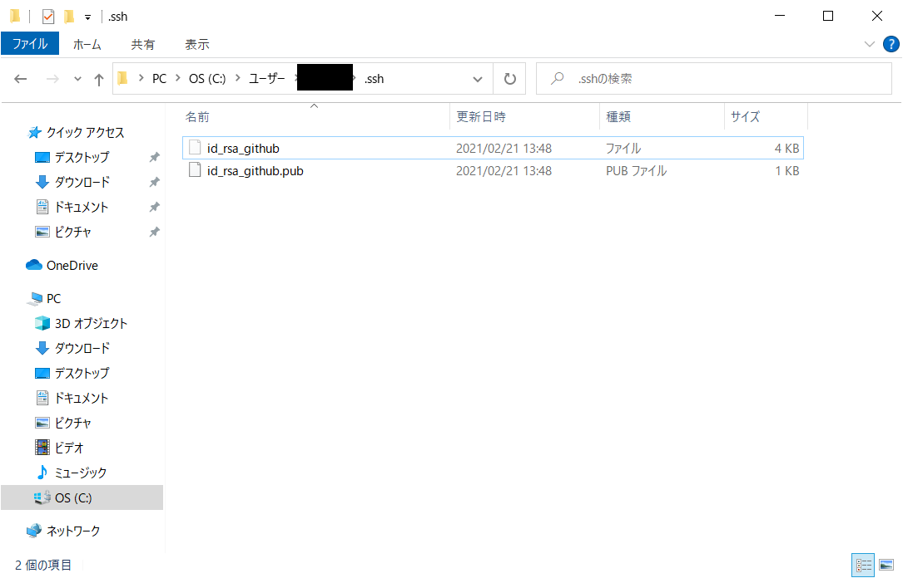
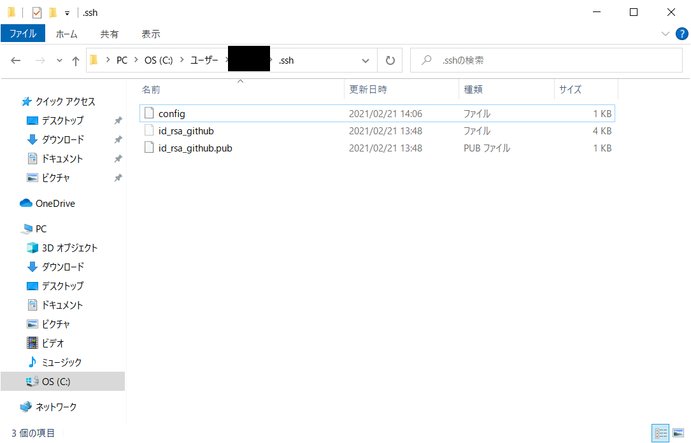
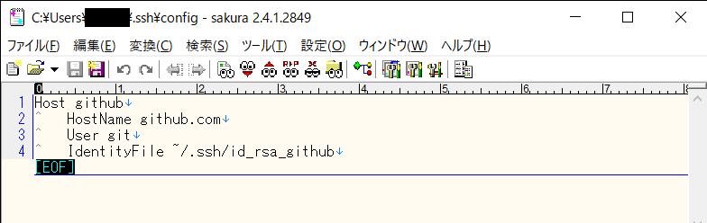
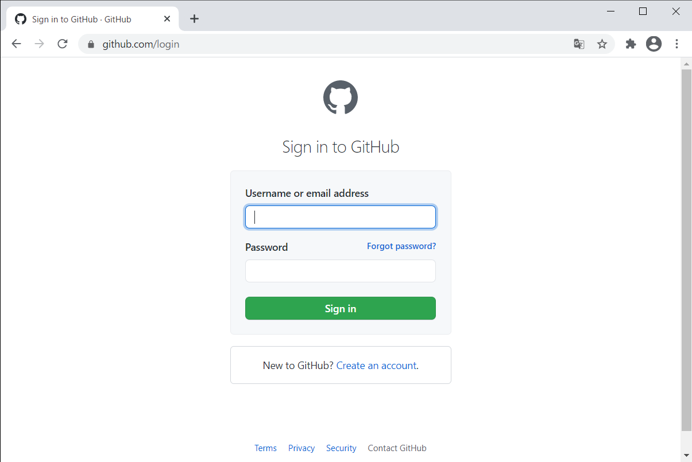
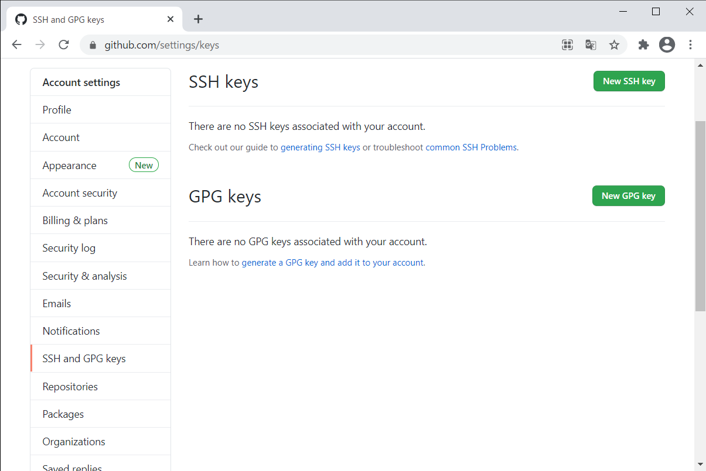
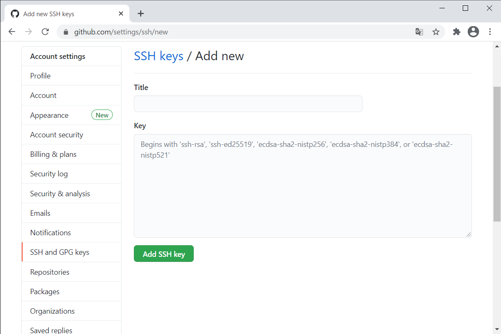
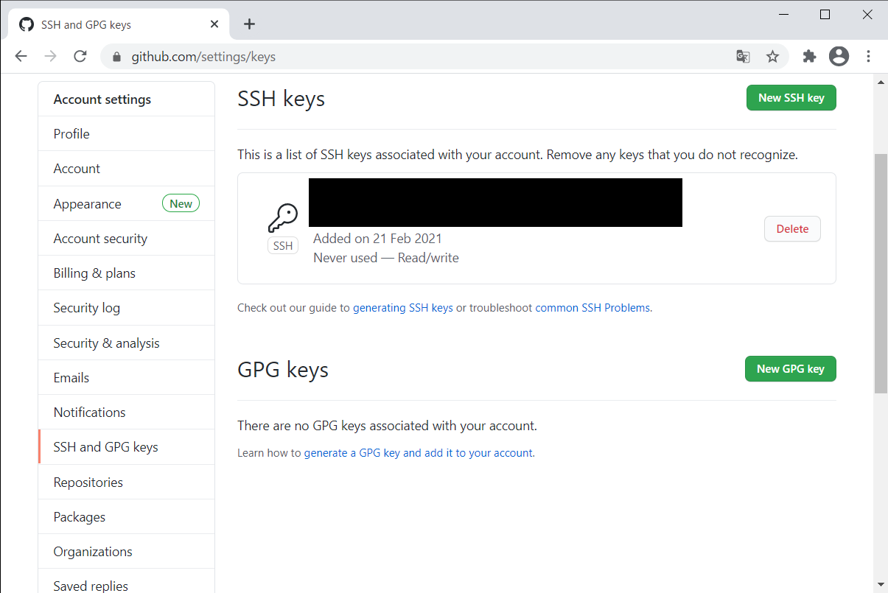
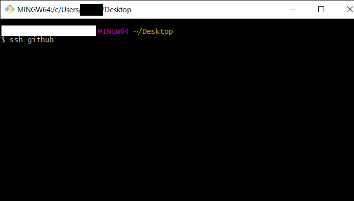

# GitHubとSSHで接続する場合
## SSHの鍵を取得する
1. aaa
     
1. aaa
     
1. aaa
     
1. aaa
     
1. aaa
     
1. aaa
     

## GitHubに公開鍵を登録する
1. aaa
     
1. aaa
     
1. aaa
     
1. aaa
     
1. aaa
     

***
## 参考
- [今日からはじめるGitHub 〜 初心者がGitをインストールして、プルリクできるようになるまでを解説](https://eh-career.com/engineerhub/entry/2017/01/31/110000)
- [【Git】Windows環境でGitHubにSSH接続してコミットするまでの手順](https://qiita.com/hollyhock0518/items/a3fee20951cd92c87ed9)
