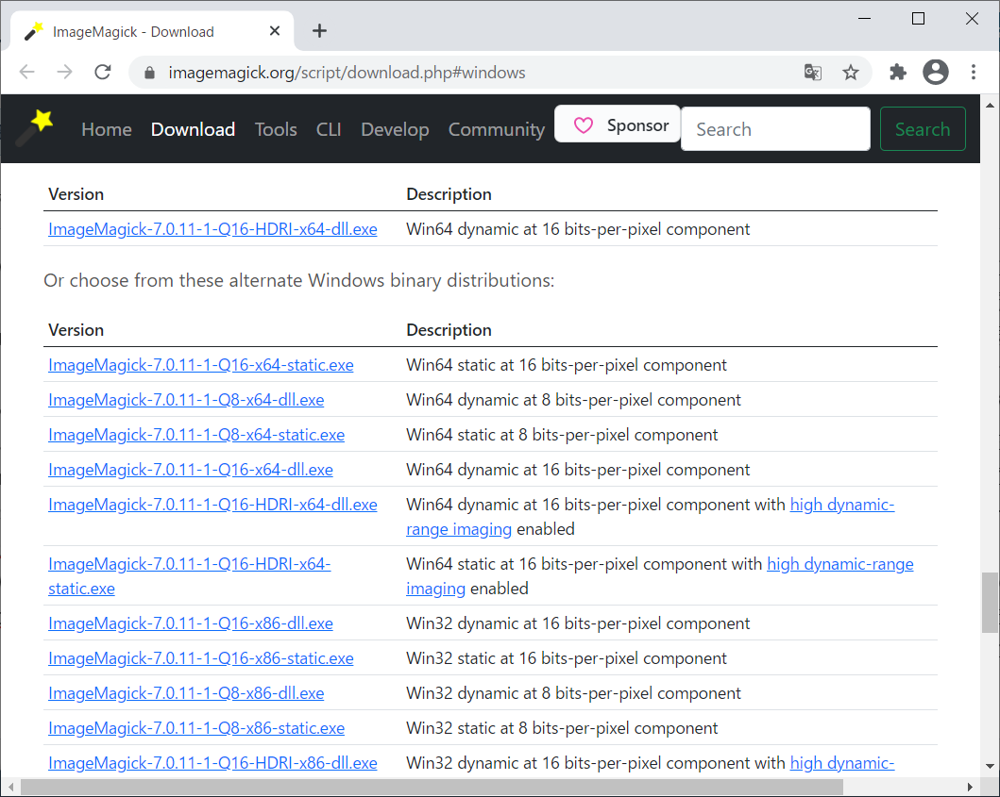
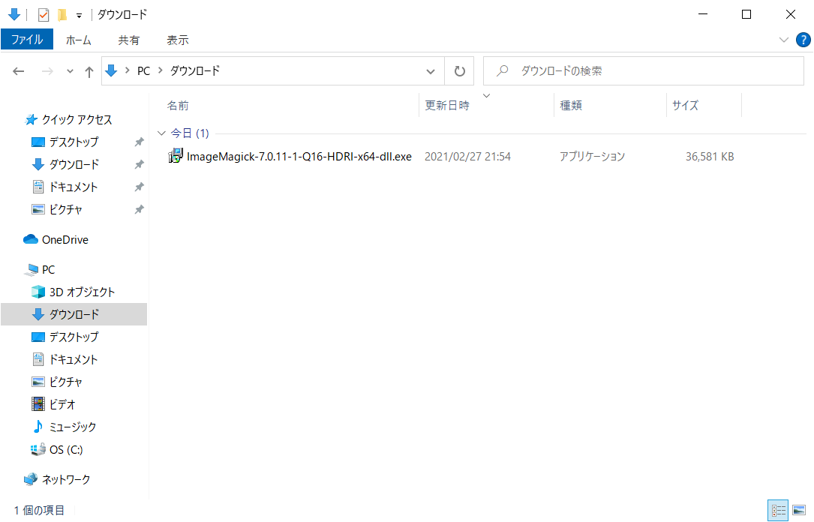
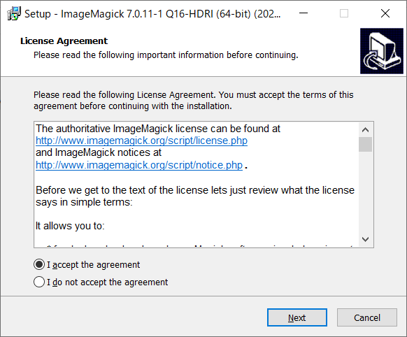
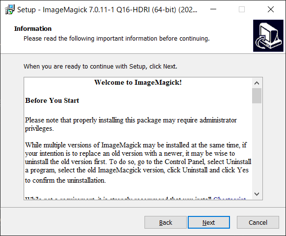
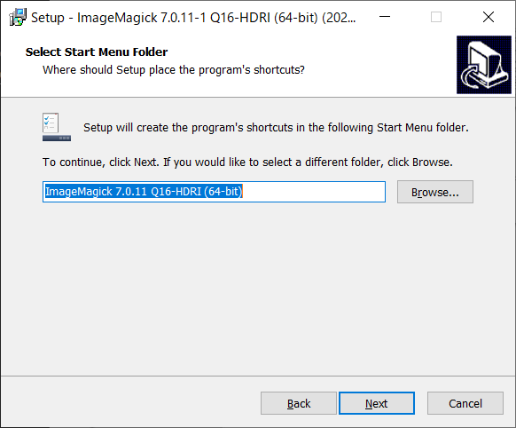
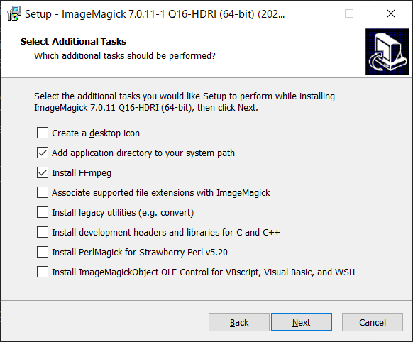
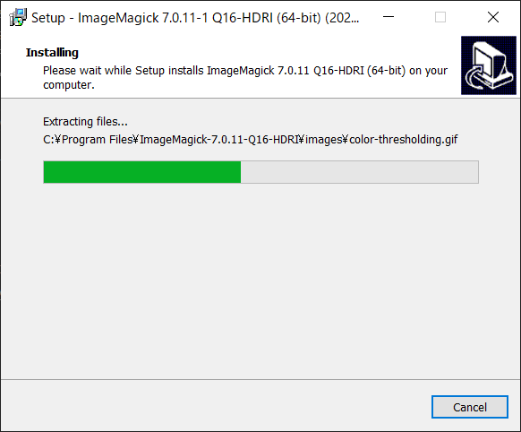
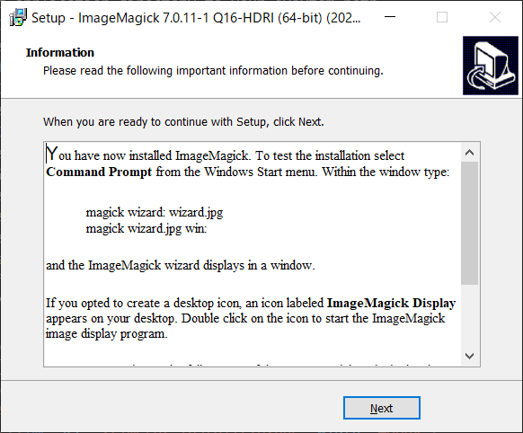
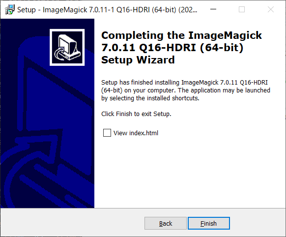

# ImageMagickインストール手順
- 最終更新日：2021/02/27

## ダウンロード
1. [https://www.imagemagick.org/script/download.php#windows](https://www.imagemagick.org/script/download.php#windows)からインストーラをダウンロード
     
    - ファイル名に Q8 が付いているバージョンは 8 ビット/ピクセルのコンポーネント
    - ファイル名に Q16 が付いているバージョンは 16 ビット/ピクセルのコンポーネント
      - 精度を落とすことなく16ビットの画像を読み書きすることが可能
      - Q8 バージョンの2倍のリソースを必要とする
    - ファイル名に dll が含まれるバージョンには、ダイナミックリンクライブラリとして ImageMagick ライブラリが含まれている

## インストール
1. インストーラを起動
     
1. ライセンスを確認して [Next] 押下
     
1. 情報を確認して [Next] 押下
     
1. インストール先のフォルダを選択して [Next] 押下
    - デフォルトのままで良い

     
1. スタートメニューへの追加先を選択して [Next] 押下
    - デフォルトのままで良い

     
1. オプションを選択して [Next] 押下
    - デフォルトのままでも良い

     
    - Create a desctop icon
      - デスクトップにアイコンが作成される
    - Add application directory to your sysytem path
      - コマンドから実行できるよう path が設定される
    - Install FFmpeg
      - ffmpeg をインストールする
      - ImageMagick 内で一部使用しているらしいので念のため選択
    - Associate supported file extensions with ImageMagick
      - ImagiMagick にファイルを関連付ける
    - Install legacy utilities
      - 古いバージョンの共通部品をインストールする
    - Install development header and libraries for C and C++
    - Install perlMagick for Strawberry Perl v5.20
    - Install ImageMagickObject OLE Control for VBScript, Visual Basic and WSH
      - ライブラリとして読み込むなどして開発する際は必要と思われるが、コマンドで呼べれば良いので不要
1. インストールが開始される
     
1. [Next] 押下
     
1. [Finish] 押下
     

***

## 参考
- [【Windows10】imageMagick7のインストール手順【画像編集】](https://hsmt-web.com/blog/imagemagick-install/)

***
