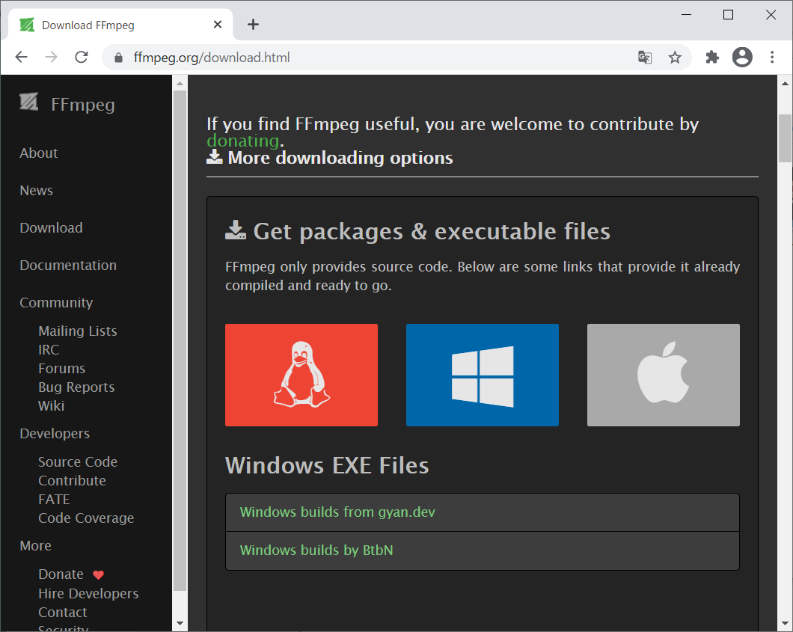
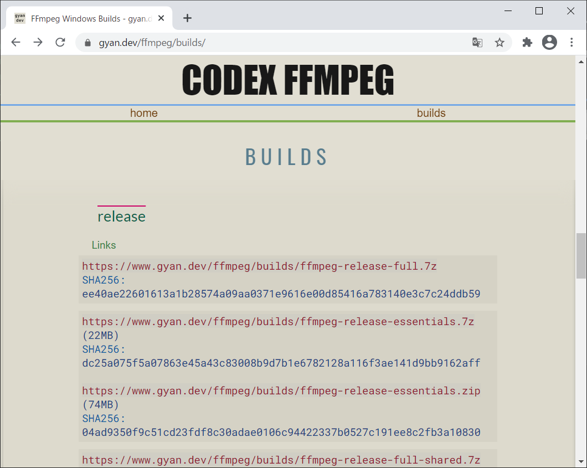
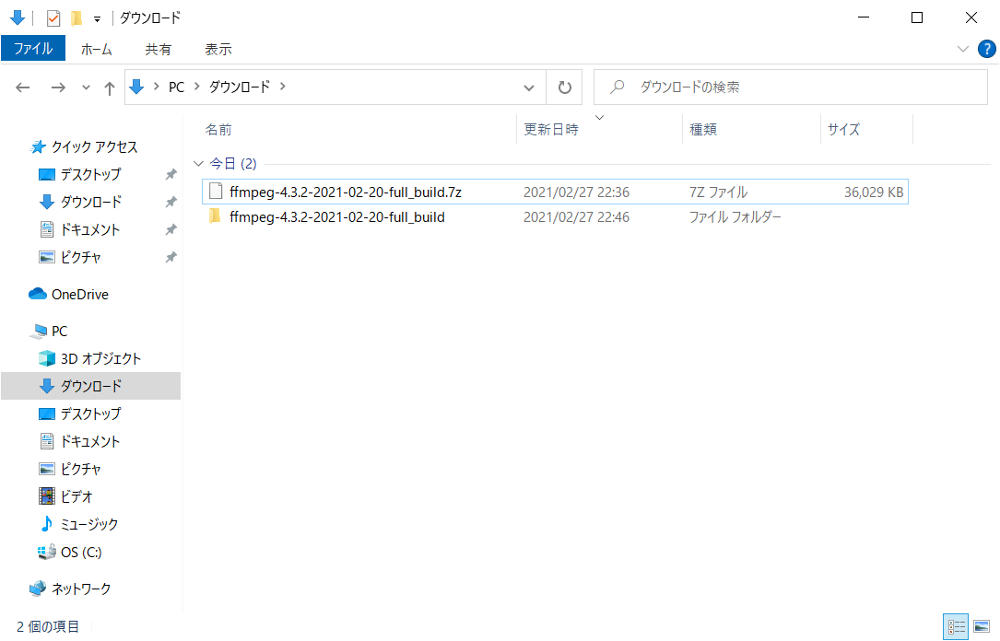
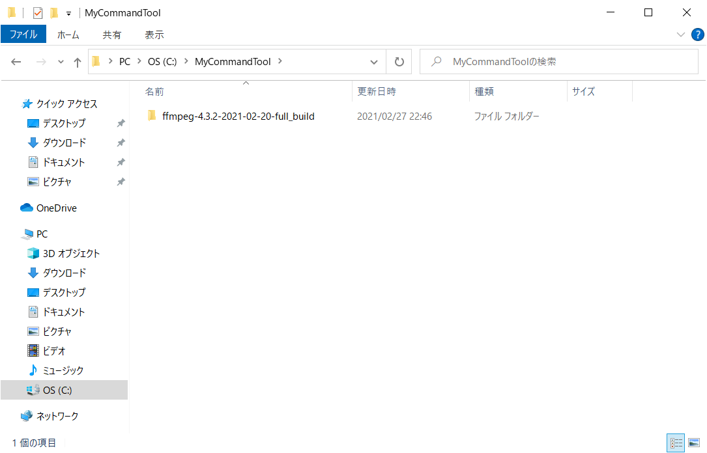
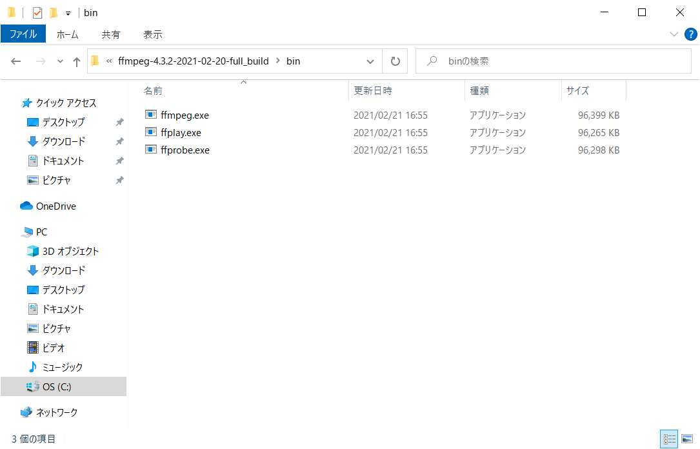
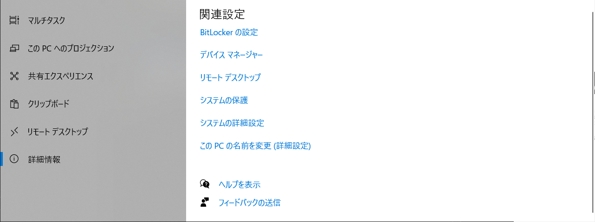
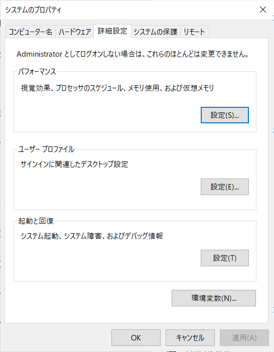
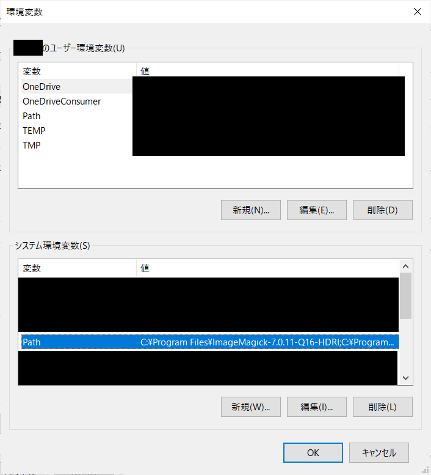
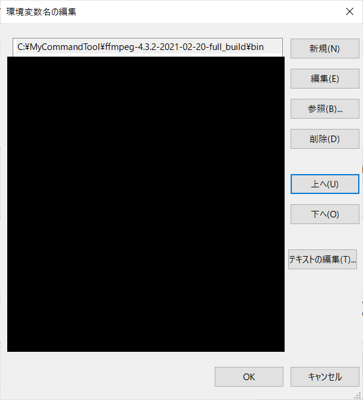

# FFmpegインストール手順
- 最終更新日：2021/02/27

## ダウンロード
1. [https://ffmpeg.org/download.html](https://ffmpeg.org/download.html)から [Windows builds from gyan.dev] を選択
     
1. [ffmpeg-release-full.7z] をダウンロード
     
    - full_build
      - 最新のリリースブランチからビルドされている
    - essentials_build
      - 一般的に使用されているライブラリを使用して最新のリリースブランチからビルドされている
    - shared
      - C 言語などで読み込めるライブラリを含む

## セッティング
1. ダウンロードしたファイルを解凍
     
1. 解凍したフォルダを任意のフォルダに配置
     
1. 配置したフォルダ内の bin フォルダにパスを通す
    - bin フォルダ内にビルド済みのファイルが配置されている

     
    - Windowsの設定から システム > 詳細情報 > システムの詳細設定 を開く

     
    - 詳細設定タブの [環境変数] 押下

     
    - システム環境変数の Path を選択して [編集] 押下

     
    - [新規] を押下して配置したフォルダ内の bin フォルダを入力

     

    - システムの詳細設定が閉じるまで [OK] を押下

***

## 参考
- [【Windows】Windows10にffmpegをインストールする](https://rikoubou.hatenablog.com/entry/2019/11/07/144533)

***
