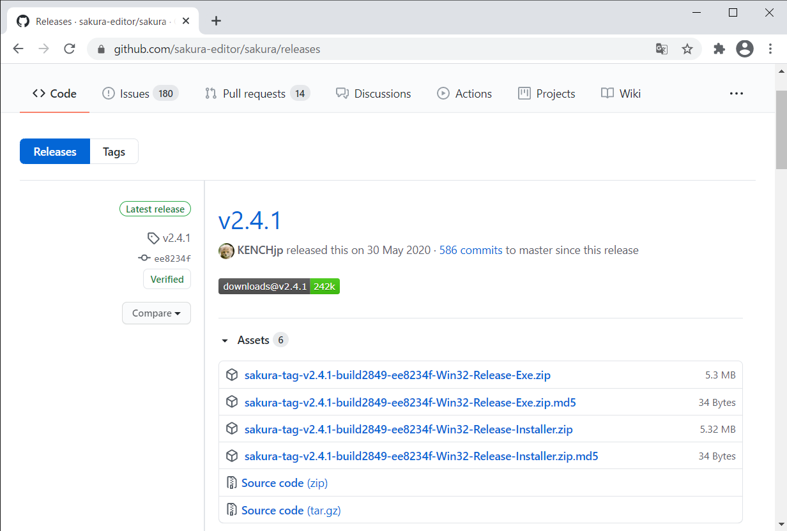
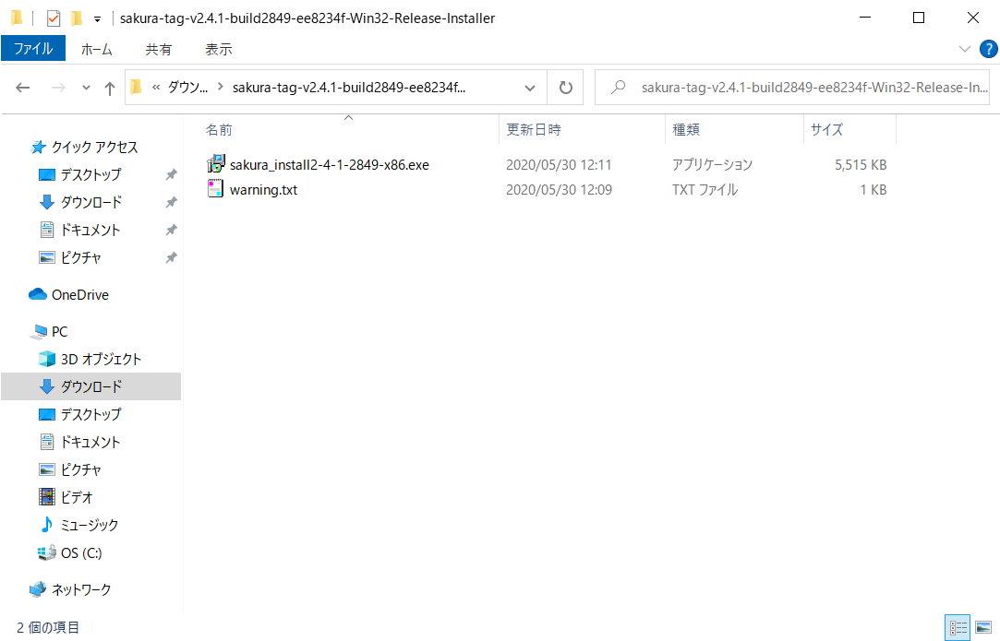
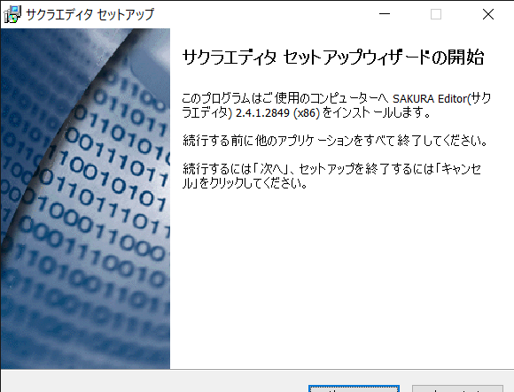
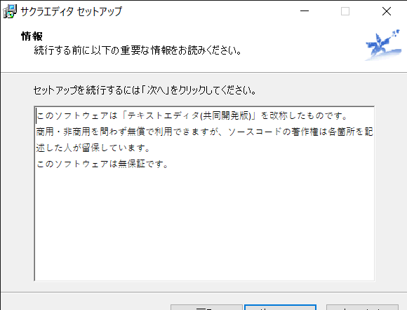
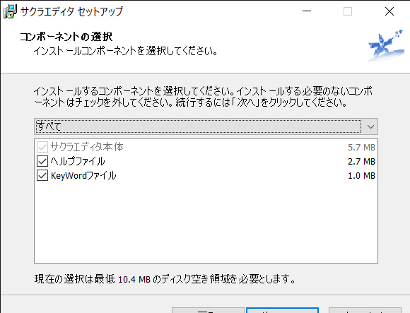
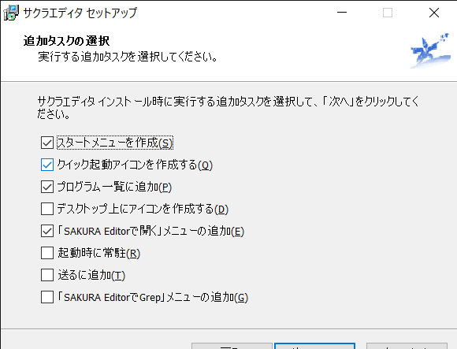
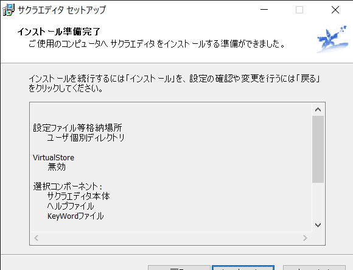
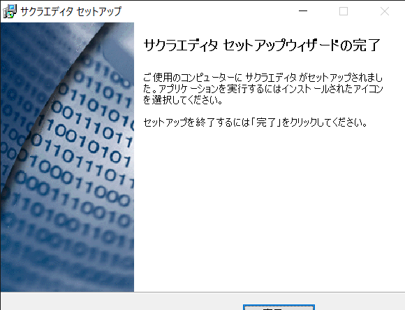

# サクラエディタインストール手順
## ダウンロード
1. [https://github.com/sakura-editor/sakura/releases](https://github.com/sakura-editor/sakura/releases)からインストーラをダウンロード
    - [〇〇-Release-Installer.zip] をダウンロード
    - 7Zip などで解凍
      - Windows 標準の機能で解凍した場合警告が表示される（らしい）

     

## インストール
1. インストーラを起動
     
1. 日本語を選択して [次へ] 押下
     
1. [次へ] 押下
     
1. 情報を確認して [次へ] 押下
     
1. コンポーネントを選択して [次へ] 押下
    - デフォルトのままで良い

     
1. 追加のタスクを選択して [次へ] 押下
    - デフォルトのままで良い

     
1. [インストール] 押下
     
1. [完了] 押下
     
