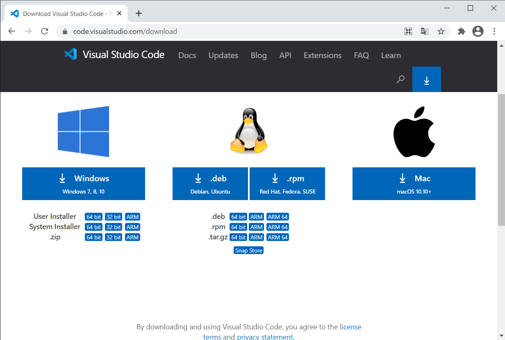
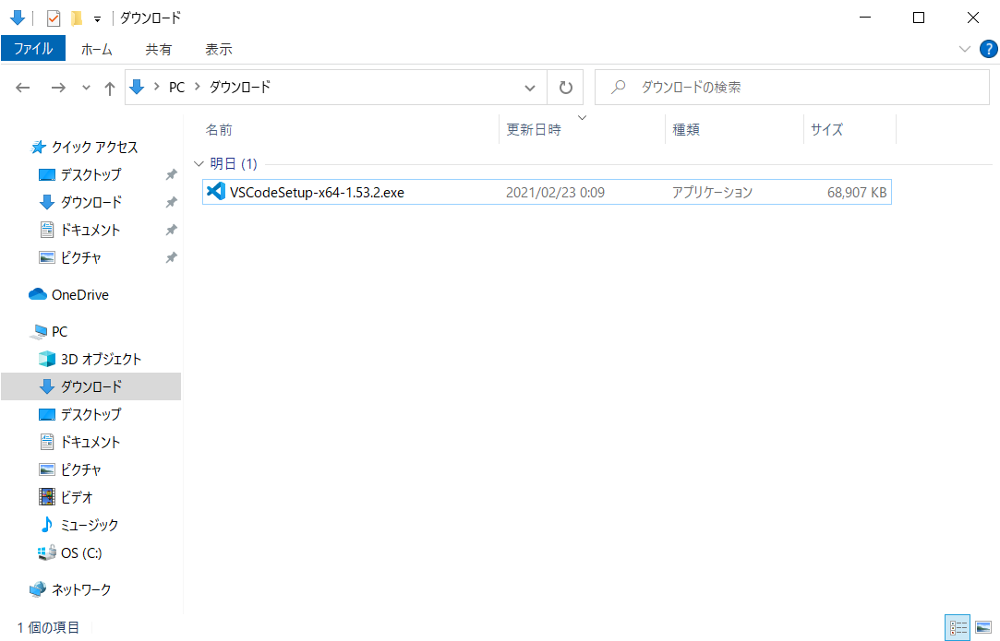
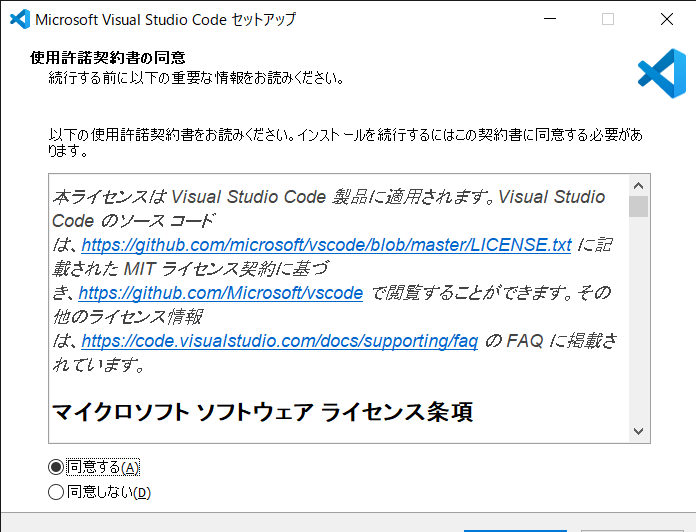
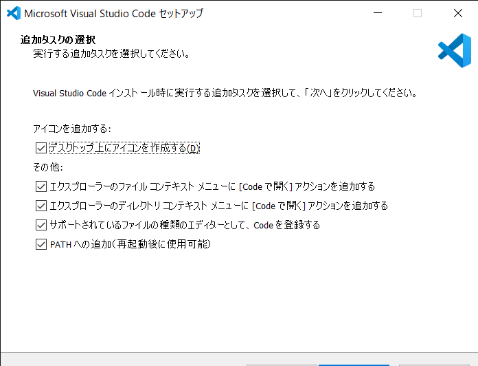
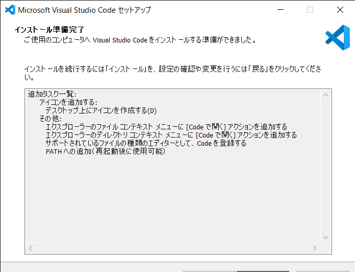
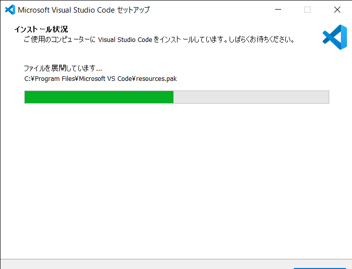
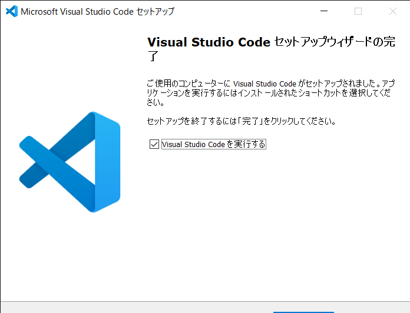
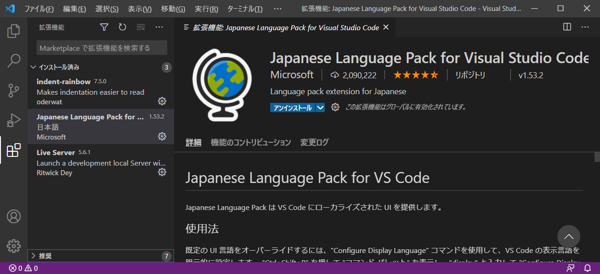
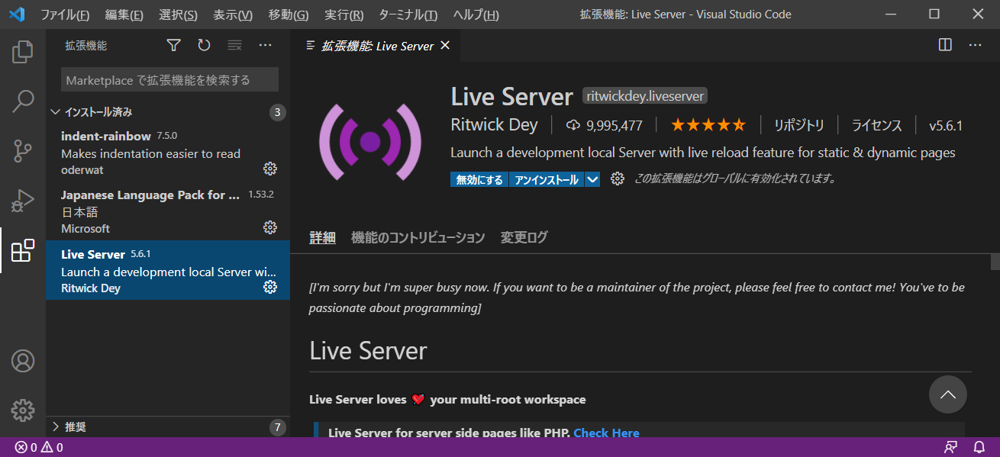
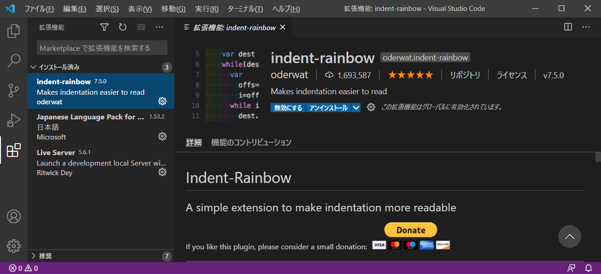

# Visual Studio Code インストール手順
- 最終更新日：2021/02/23

## ダウンロード
1. [https://code.visualstudio.com/download](https://code.visualstudio.com/download)から [System Installer] をダウンロード
     
    - User Installer
      - インストールを実行したユーザのみ使用可能
    - System Installer
      - 端末を使用する全ユーザ使用可能
    - .zip
      - インストールなしで使用可能

## インストール
1. インストーラを起動
     
1. [同意する] をチェックして [次へ] 押下
     
1. [Code で開く] を選択して [Next] 押下
    - 2箇所にチェックをつける

     
1. インストール内容を確認して [インストール] 押下
     
1. インストールが開始される
     
1. [完了] 押下
     

## セッティング
1. 以下の拡張機能をダウンロード
    - Japanese Language Pack for Visual Studio Code
      - vscodeの日本語パック

     
    - Live Server
      - ローカル開発サーバーの起動

     
    - indent-rainbow
      - インデントを読みやすくするためのシンプルな拡張機能

     

***

## 参考
- [【開発環境】Visual Studio CodeのUser InstallerとSystem Installerの違いは？Zip版って？](https://wakky.tech/difference-user-system/)

***
