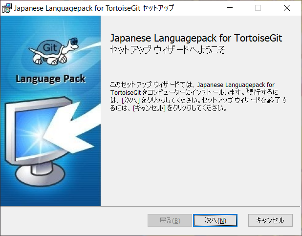

# TortoiseGitインストール手順
## ダウンロード
- [https://tortoisegit.org/download/](https://tortoisegit.org/download/)からインストーラをダウンロード
  
- 日本語パックもダウンロード
  

## インストール
- 手順1
  
- 手順2
  
- 手順3
  
- 手順4
  
- 手順5
  
- 手順6
  
- 手順7
  

## 日本語化
- 手順1
  
- 手順2
  
- 手順3
  
  - [Configure TortoiseGit to use this language] をチェック

***
## 参考
- [TortoiseGitインストール手順＜Windows向け＞](https://sukkiri.jp/technologies/devtools/git/tortoisegit_win.html)
