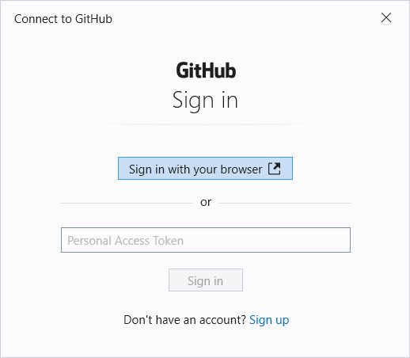
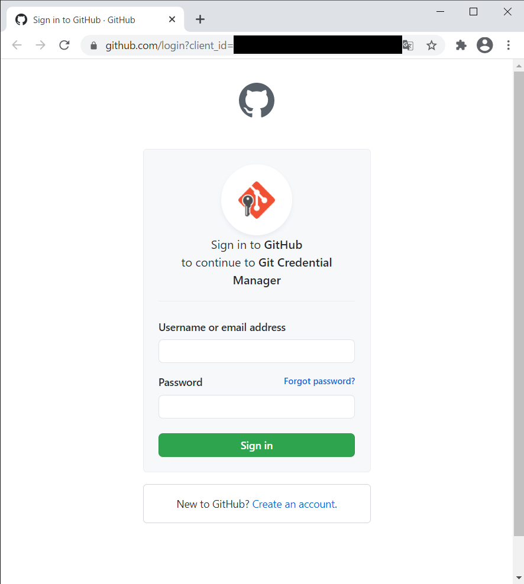
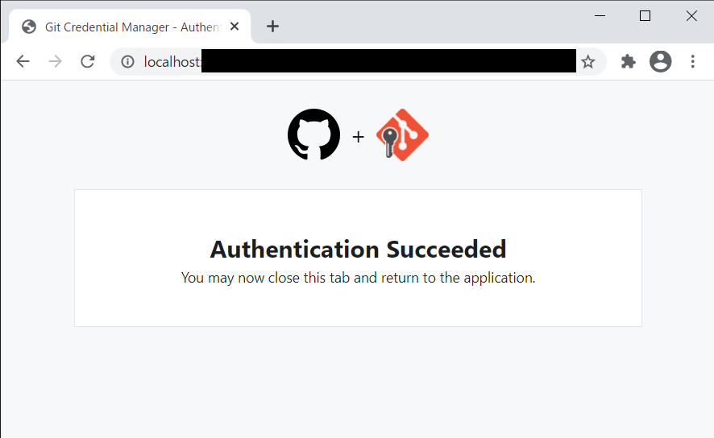
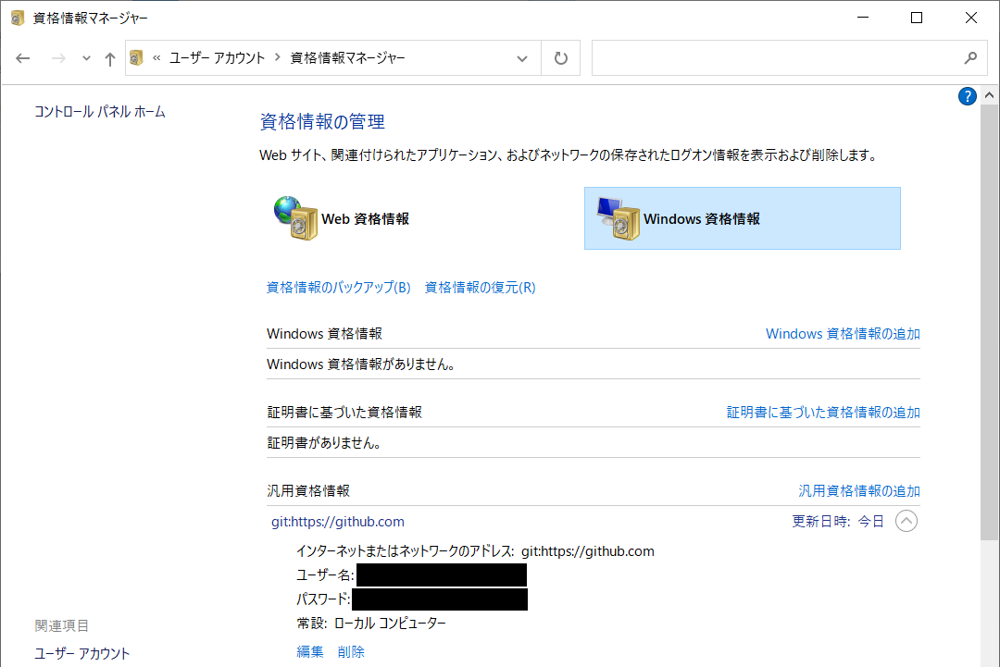

# GitHubとHTTPSで接続する場合
- 最終更新日：2021/02/23

## HTTPS の URL からクローン
- 初回クローン時に認証を求められる
1. [Sign in with your browser] を押下
     
1. ログイン情報を入力してログイン
     
    - 認証に成功すると以下の画面が表示される

     
    - 認証情報はWindows 資格情報に保存される
      - コントロール パネル\ユーザー アカウント\資格情報マネージャー

     

***
