# GitHubとSSHで接続する場合
## SSHの鍵を取得する
1. ssh-keygenコマンドで鍵を生成
    - Git Bashを起動し、以下のコマンドを実行
    ``` bash
    ssh-keygen -t rsa -b 4096 -C "e-mailアドレスなどの任意のコメント"
    ```
    - 生成される鍵のファイル名と出力場所を確認するメッセージが表示されるため、GitHub用であることが分かるようファイル名を変更
    ``` bash
    Enter file in which to save the key (/c/Users/ [ユーザ名] /.ssh/id_rsa): /c/Users/ [ユーザ名] /.ssh/id_rsa_github
    ```
    - パスフレーズを入力
    ``` bash
    Enter passphrase (empty for no passphrase): 【パスフレーズ（画面には表示されない）】
    Enter same passphrase again: 【パスフレーズ（画面には表示されない）】
    ```

    <br />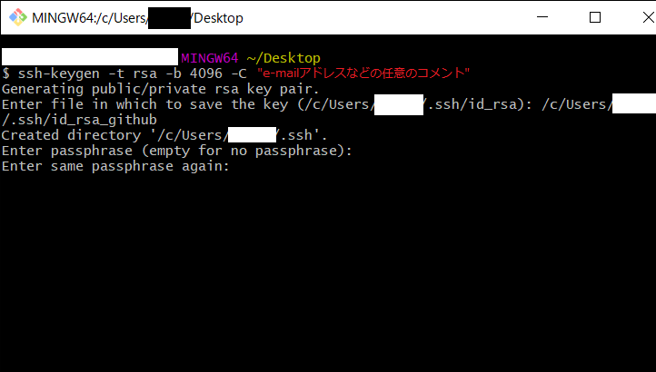
1. 生成された鍵を確認
    - 拡張子なしのファイルが秘密鍵
    - pubファイルが公開鍵

    <br />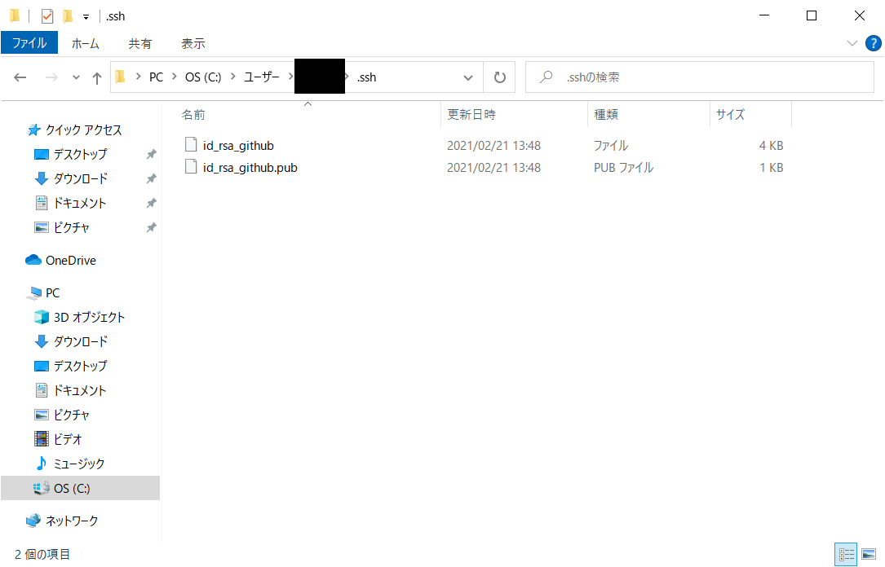
1. 秘密鍵の属性を変更する
    - Windows の場合
      - 読み取り専用の隠しファイルにする
      <br />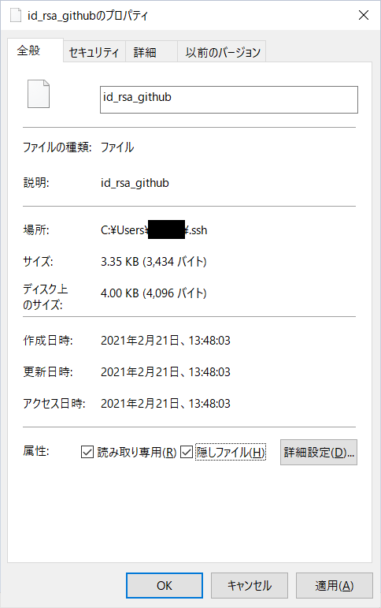
      <br />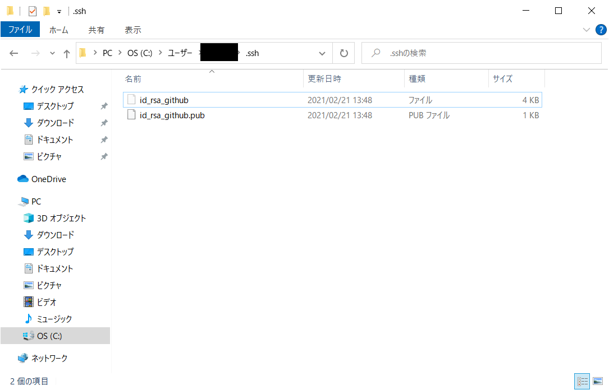
      - 本来はWindows 以外と同様パーミッションを変更すべきだが、[chmod] による変更が行えないためこのようにしている
    - Windows 以外の場合
      - 以下のコマンドでパーミッションを600にする
      ``` bash
      chmod 600 ~/.ssh/id_rsa_github
      ```
      - [-rw-------] になっていれば正しいパーミッションに変更できている
      ``` bash
      ls -la ~/.ssh/id_rsa_github
      ```
1. SSHのconfigファイルを編集
    - GitHubへSSH接続する際に、どの秘密鍵を指定するのかを管理するために編集
    - ファイルが存在しない場合は新規作成
    ``` bash
    vim ~/.ssh/config
    ```
    <br />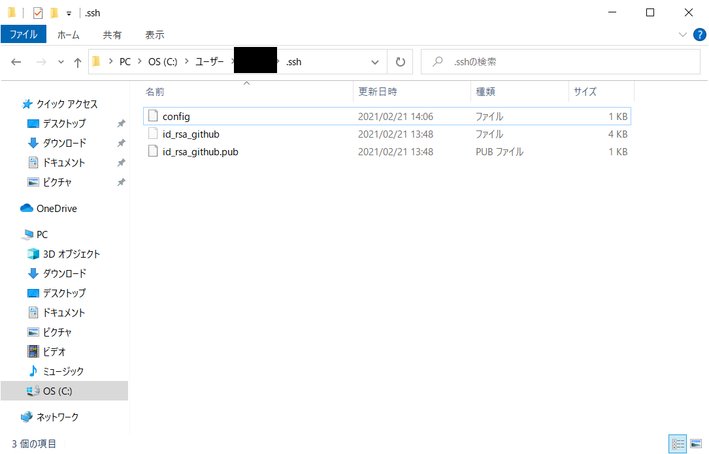
    - 以下の内容を追記
    ```
    Host github
      HostName github.com
      User git
      IdentityFile ~/.ssh/id_rsa_github
    ```
    <br />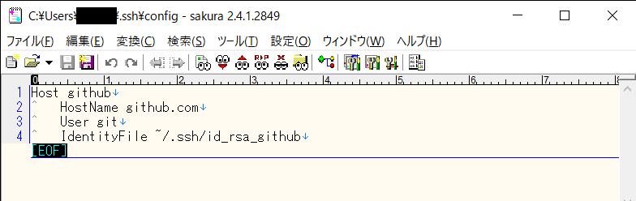

## GitHubに公開鍵を登録する
1. GitHub にログイン
    - [https://github.com/login](https://github.com/login)

    <br />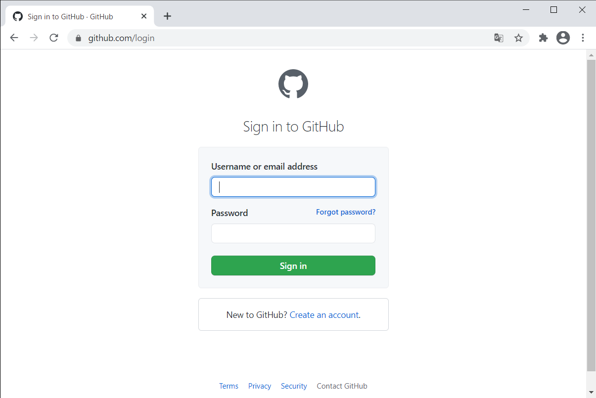
1. SSH and GPG keys を開く
    - [https://github.com/settings/keys](https://github.com/settings/keys)

    <br />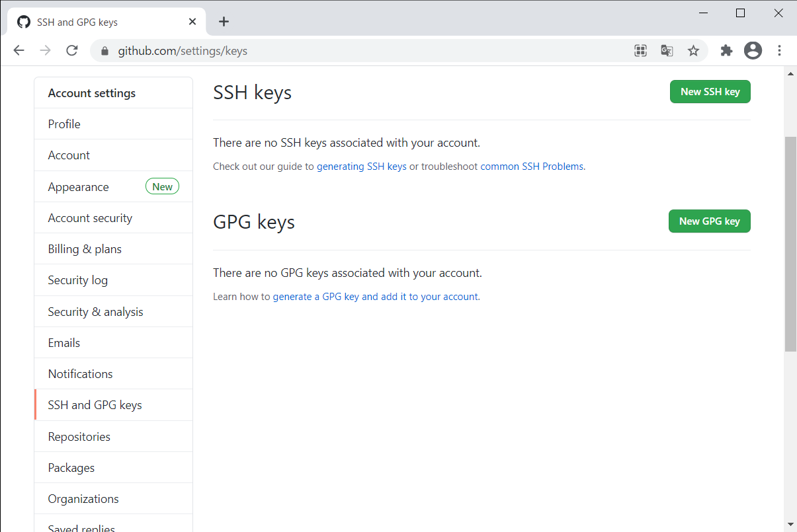
    - [New SSH key] を押下し、登録画面を開く
1. 公開鍵を登録
    - 入力したら [Add SSH key] をクリック

    <br />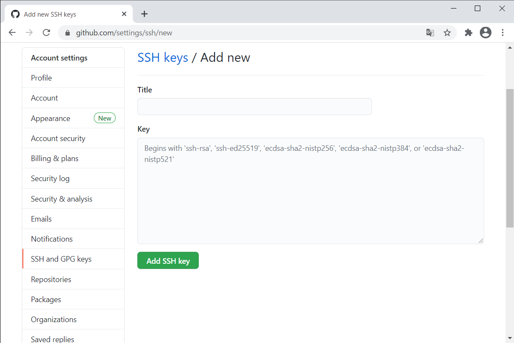
    - Title
      - 任意の値
      - PC名・サーバ名を入れておくと管理しやすい
    - Key
      - 公開鍵を開き、値をコピーしてそのまま貼り付け
1. 公開鍵が登録されたことを確認
    <br />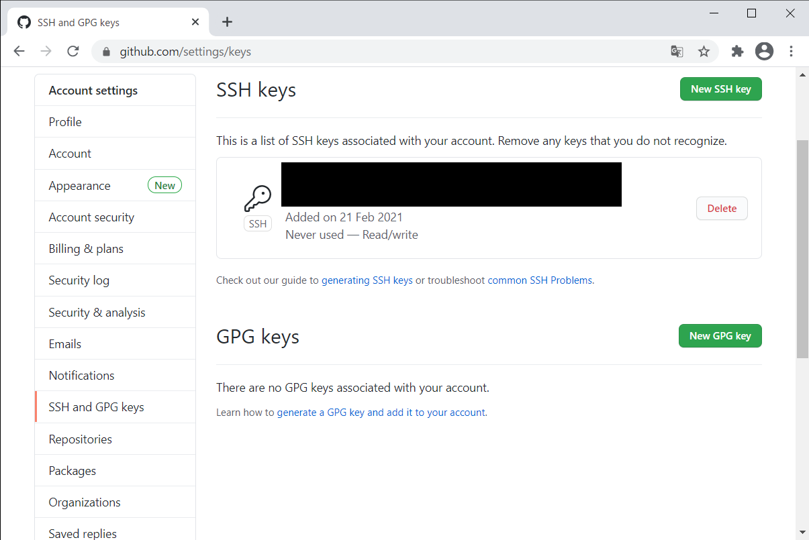
1. GitHubへのSSH接続を確認
    - Git Bashを起動し、以下のコマンドを実行
    ``` bash
    ssh github
    ```
    - パスワードを求められた場合、鍵の生成時に設定したパスフレーズを入力

    <br />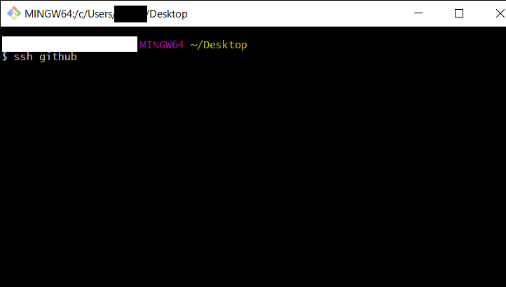
    - 次のように [You've successfully authenticated] と表示されたら成功
    ```
    Hi github-sample! You've successfully authenticated, but GitHub does not provide shell access.
    ```

***
## 参考
- [今日からはじめるGitHub 〜 初心者がGitをインストールして、プルリクできるようになるまでを解説](https://eh-career.com/engineerhub/entry/2017/01/31/110000)
- [【Git】Windows環境でGitHubにSSH接続してコミットするまでの手順](https://qiita.com/hollyhock0518/items/a3fee20951cd92c87ed9)
