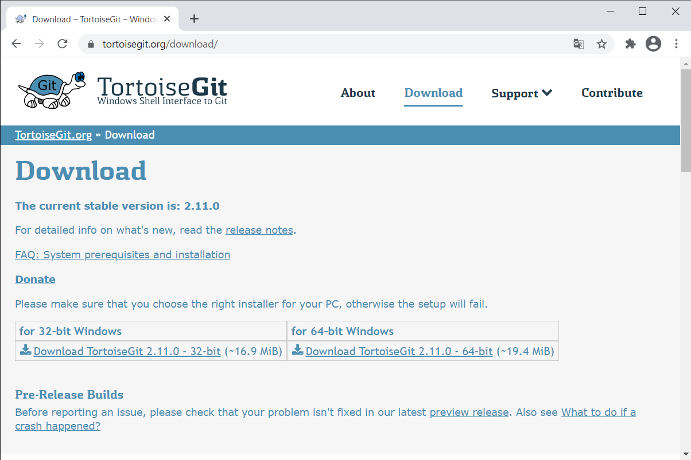
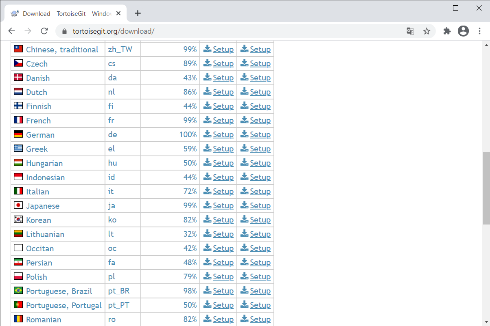
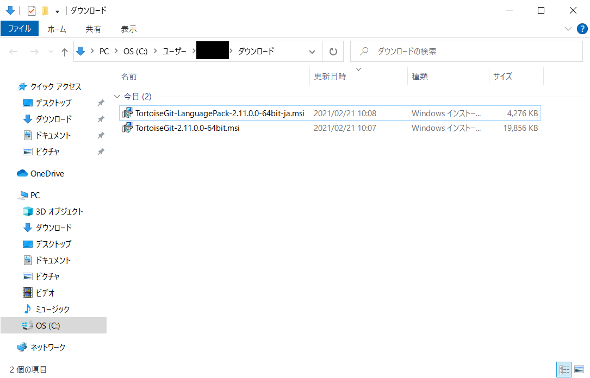
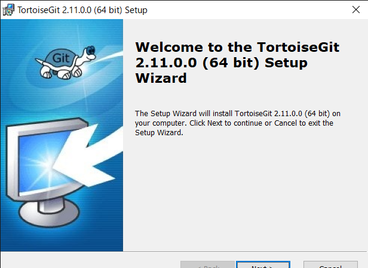
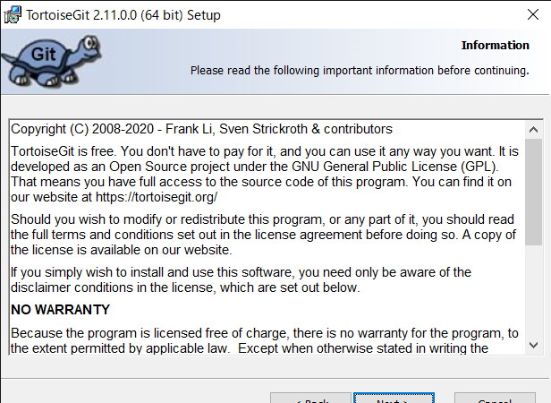
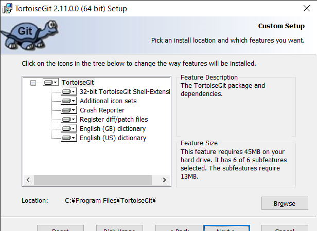
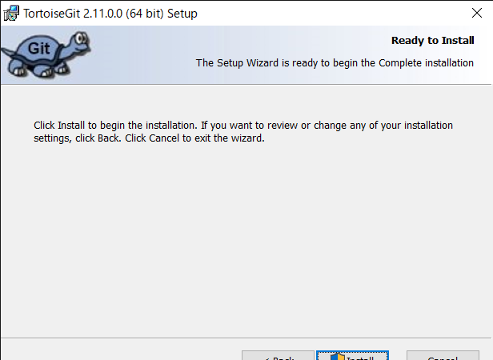
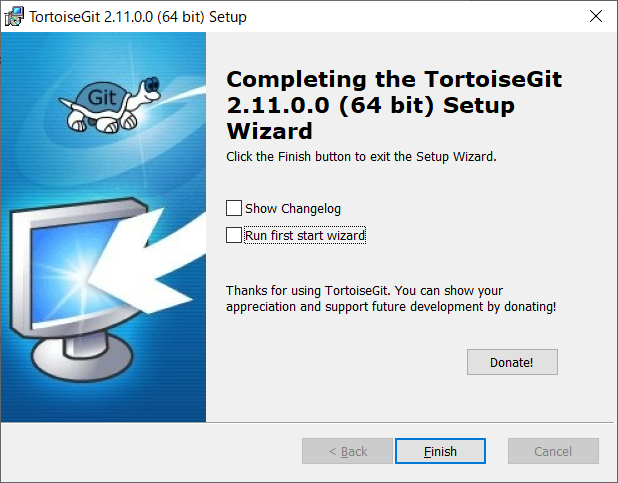
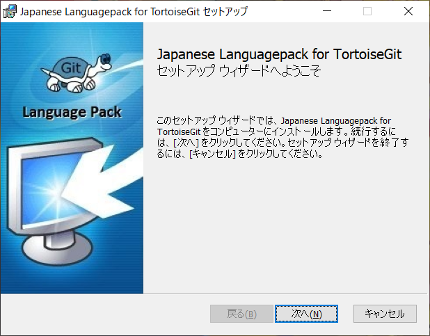

# TortoiseGitインストール手順
## ダウンロード
1. [https://tortoisegit.org/download/](https://tortoisegit.org/download/)からインストーラをダウンロード
     
1. 日本語パックもダウンロード
     

## インストール
1. インストーラを起動
     
1. [Next] 押下
     
1. ライセンスを確認して [Next] 押下
     
1. SSH接続時に使用するクライアントを選択して [Next] 押下
    - デフォルトのままで良い

     
1. インストールフォルダを選択して [Next] 押下
    - デフォルトのままで良い

     
1. [Install] 押下
     
1. [Finish] 押下
    - チェックは外して良い

     

## 日本語化
1. 日本語パック（LanguagePack）を起動
     
1. [次へ] 押下
     
1. [Configure TortoiseGit to use this language] をチェックして [完了] 押下
     

***

## 参考
- [TortoiseGitインストール手順＜Windows向け＞](https://sukkiri.jp/technologies/devtools/git/tortoisegit_win.html)

***
