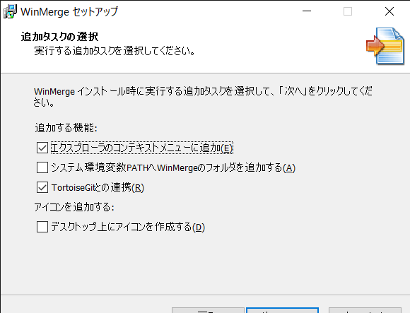
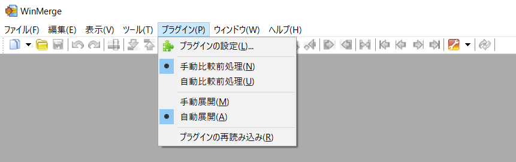

# WinMergeインストール手順
## ダウンロード
1. [https://winmergejp.bitbucket.io/](https://winmergejp.bitbucket.io/)からインストーラをダウンロード
    <br />

## インストール
1. インストーラを起動
    <br />
1. ライセンスを確認して [次へ] 押下
    <br />
1. インストール先を指定して [次へ] 押下
    - デフォルトのままで良い

    <br />
1. インストールするコンポーネントを選択して [次へ] 押下
    - デフォルトのままで良い

    <br />
1. スタートメニューフォルダを指定して [次へ] 押下
    - デフォルトのままで良い

    <br />
1. TortoiseGitと連携するようチェックをつけて [次へ] 押下
    - デフォルトのままで良い

    <br />
1. TortoiseGitの3方向マージツールとして登録するよう選択して [次へ] 押下
    - デフォルトのままで良い

    <br />
1. [インストール] 押下
    <br />
1. 情報を確認して [次へ] 押下
    <br />
1. [完了] 押下
    <br />

## セッティング
1. WinMerge を開きメニューの [プラグイン] を開く
    - [自動展開] を選択
    - [プラグインの設定] を開く

    <br />
1. [CompareMSExcelFile.sct] を選択して [プラグインの設定] 押下
    <br />
    - CompareMSExcelFile.sct
      - Excelファイルを比較するための展開プラグイン
1. [ワークシートを画像化して比較する] にチェックをつけて [OK] 押下
    - [ワークブックの情報を複数ファイルに展開する] にもチェックがつく

    <br />

## TortoiseGit を設定
1. TortoiseGit の設定を開く
    <br />
1. 設定画面の [差分ビューア] 内の [高度な設定] 押下
    - [異なるリビジョンのファイルの比較に使用するプログラムの設定] の内容をコピーしておく

    <br />
1. Excelファイルの拡張子を選択して [編集] 押下
    <br />
1. [外部プログラム] に WinMerge を指定して [OK] 押下
    - [差分ビューア] に入力されていた以下の内容を入力
    ```
    C:\Program Files\WinMerge\WinMergeU.exe -e -ub -dl %bname -dr %yname %base %mine
    ```

    <br />
1. Excel ファイルの各拡張子について同様に設定
    <br />

***
## 参考
- [【WinMerge】インストールする方法](https://pc-chain.com/winmerge-install/8668/)
- [【WinMerge】Excelファイルの差分を比較する](http://bashalog.c-brains.jp/18/04/03-180000.php)
