# WinMergeインストール手順
## ダウンロード
1. [https://winmergejp.bitbucket.io/](https://winmergejp.bitbucket.io/)からインストーラをダウンロード
     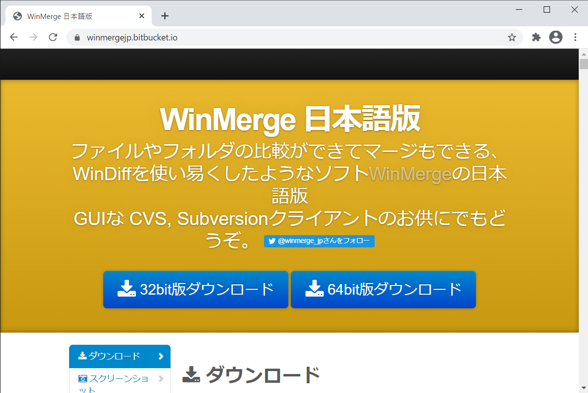

## インストール
1. して [AA] 押下
     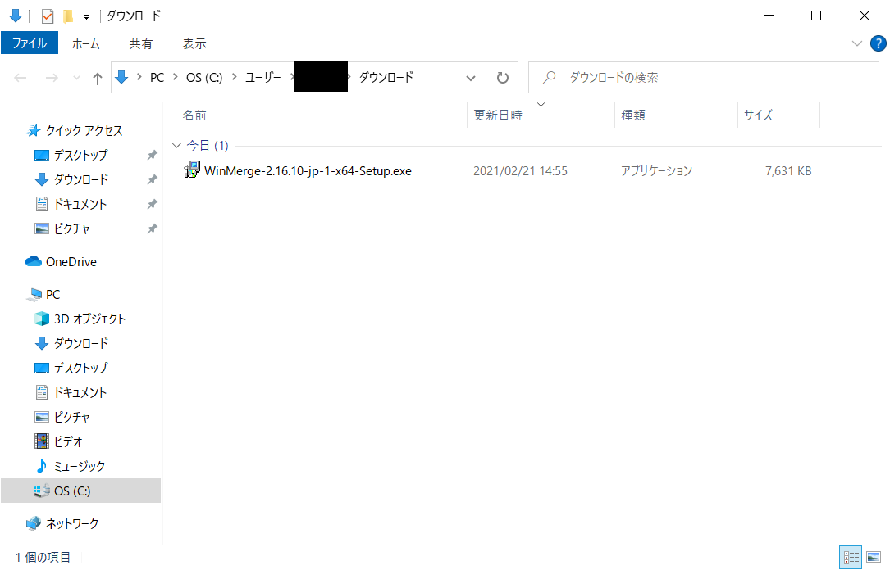
1. して [AA] 押下
     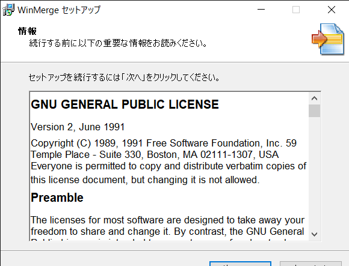
1. して [AA] 押下
     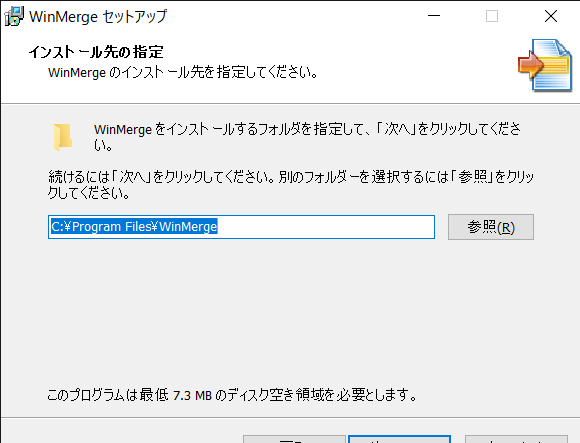
1. して [AA] 押下
     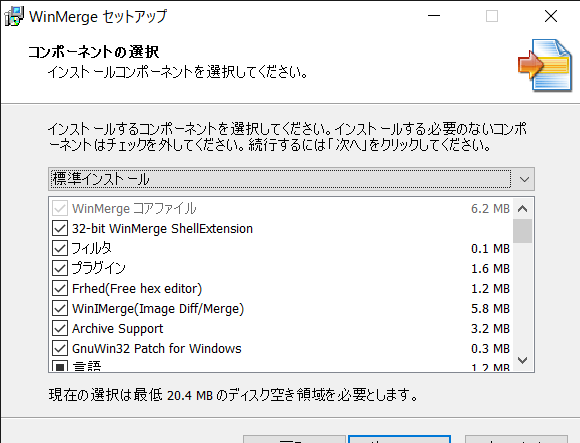
1. して [AA] 押下
     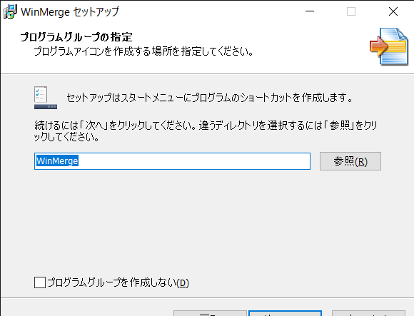
1. して [AA] 押下
     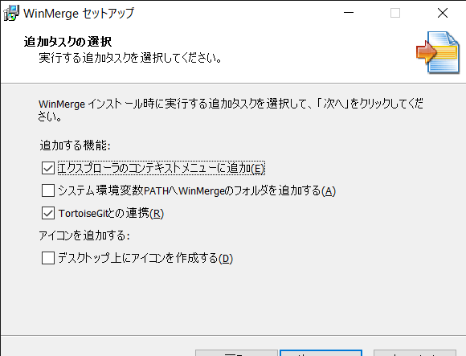
1. して [AA] 押下
     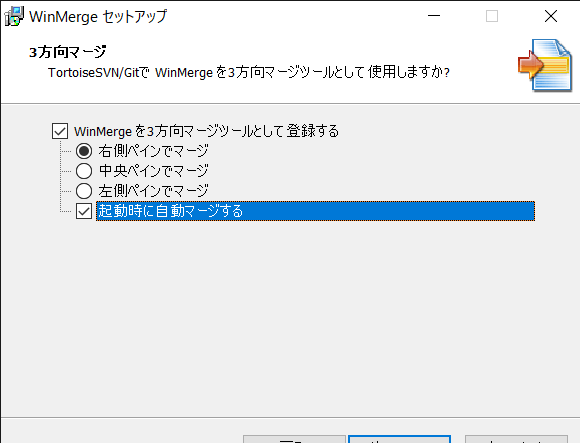
1. して [AA] 押下
     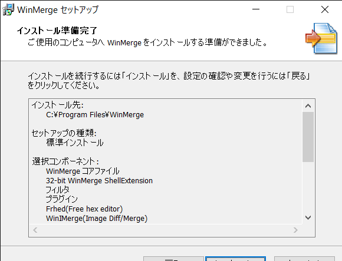
1. して [AA] 押下
     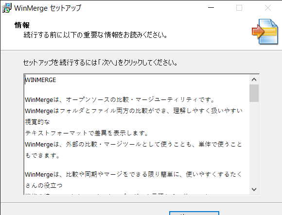
1. して [AA] 押下
     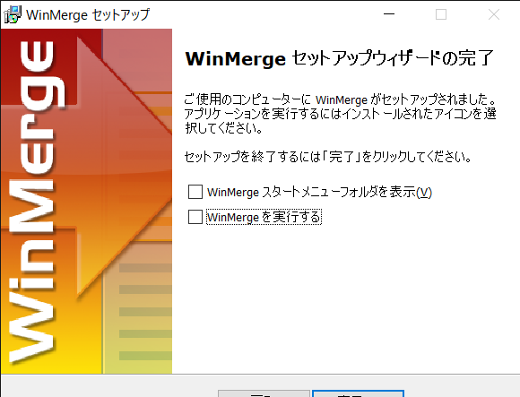

## セッティング
1. aaa
     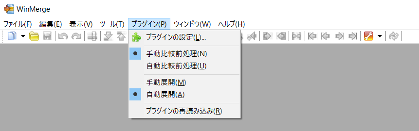
1. aaa
     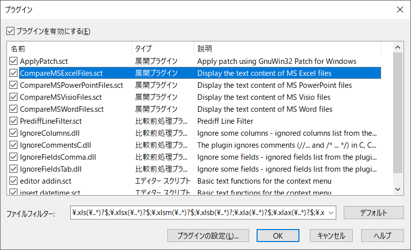
1. aaa
     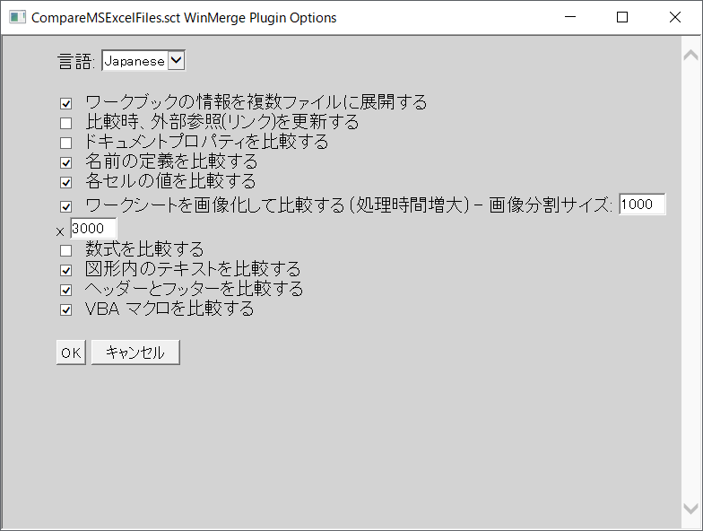

## セッティング
1. aaa
     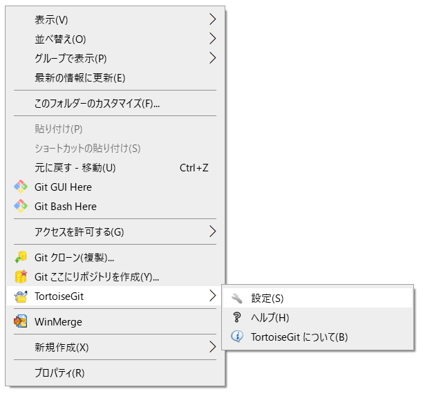
1. aaa
     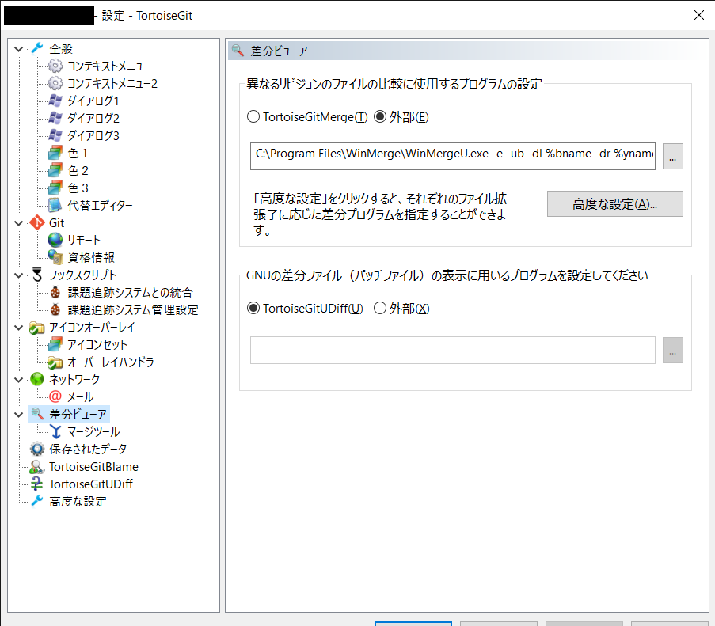
1. aaa
     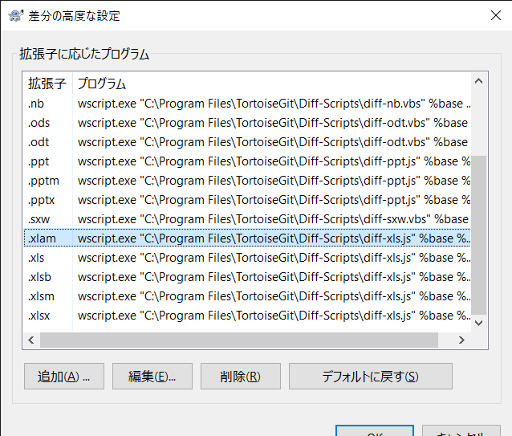
1. aaa
     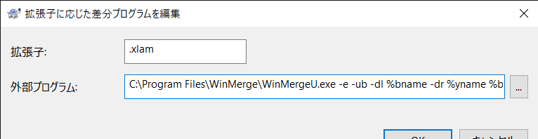
1. aaa
     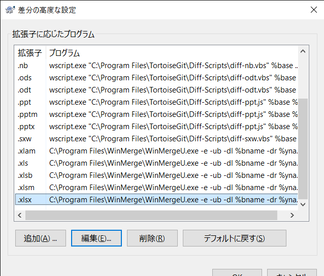

***
## 参考
- [【WinMerge】インストールする方法](https://pc-chain.com/winmerge-install/8668/)
- [【WinMerge】Excelファイルの差分を比較する](http://bashalog.c-brains.jp/18/04/03-180000.php)
