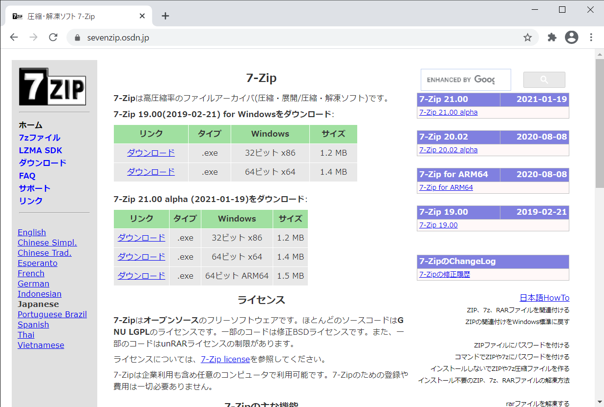
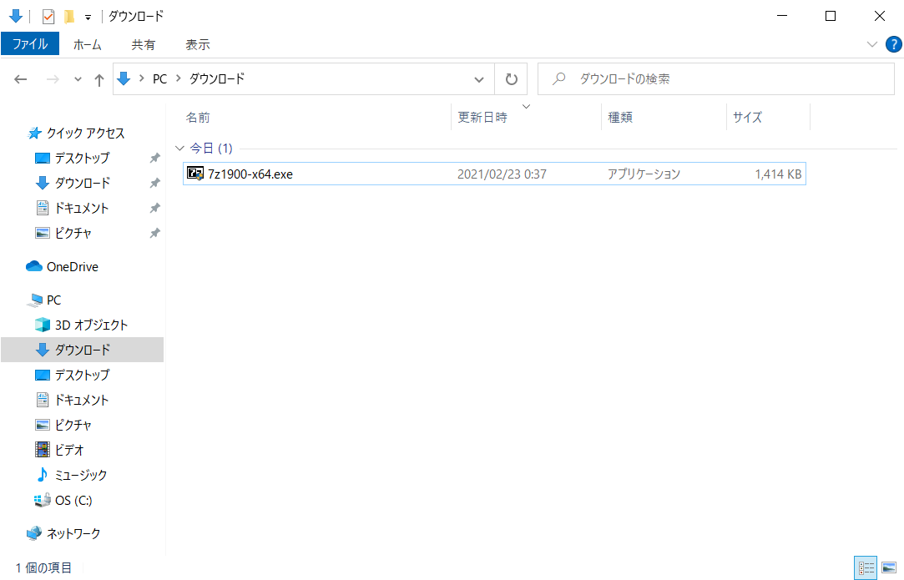
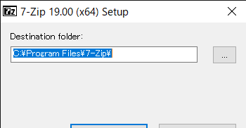
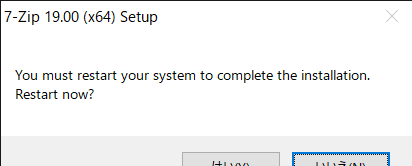

# 7Zipインストール手順
- 最終更新日：2021/02/23
- 操作中に再起動あり

## ダウンロード
1. [https://sevenzip.osdn.jp/](https://sevenzip.osdn.jp/)からインストーラをダウンロード
    - alphaではない方をダウンロード

     

## インストール
1. インストーラを起動
     
1. インストール先のフォルダを選択して [Next] 押下
    - デフォルトのままで良い

     
1. [はい] 押下して再起動
     

***
